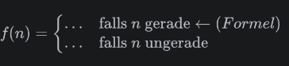

<ul style="list-style-type:circle;">
  <li>REFR - Prof. Franz Reichel</li>
  <li>DSAI - Data Science and Artificial Intelligence - 4XHIF</li>
</ul>

---

# Übung: Die Collatz-Vermutung

---

## Das Problem

Nimm dir eine beliebige natürliche Zahl und wende immer wieder dieselbe Regel an:

- Ist die Zahl **gerade**, halbiere sie.
- Ist die Zahl **ungerade**, nimm sie mal drei und addiere eins.

Für die 3 sieht das so aus:

$
3 → 10 → 5 → 16 → 8 → 4 → 2 → 1
$

Bei 1 hört man auf – denn ab da geht es nur noch im Kreis: 1 → 4 → 2 → 1 → 4 → 2 → …

Der Weg dorthin ist völlig unberechenbar. Und vor allem: Die Folge geht nicht einfach abwärts. Sie klettert unterwegs weit über ihre Startzahl hinaus, bevor sie abstürzt. Bei der 7 sieht man das gut:

```
7 → 22 → 11 → 34 → 17 → 52 → 26 → 13 → 40 → 20 → 10 → 5 → 16 → 8 → 4 → 2 → 1
                         ▲
                     Maximum
```

Start bei 7, Ende bei 1 – aber zwischendurch bei **52**, dem Siebeneinhalbfachen der Startzahl. Diesen größten Wert einer Folge nennen wir im Folgenden ihr **Maximum**.

Der Grund liegt in der Regel selbst: Ungerade Zahlen werden mehr als verdreifacht, gerade nur halbiert. Erst wenn mehrere Halbierungen hintereinander kommen, fällt die Folge wirklich. Die 27 klettert auf diese Weise über 111 Schritte bis auf 9 232.

---

## Die Vermutung

Die Regel ist in zwei Zeilen erklärt. Die eigentliche Behauptung darüber lautet:

> Für **jede** natürliche Zahl $n \ge 1$ erreicht die Folge nach endlich vielen Schritten die 1.

Formaler ausgedrückt: Zu jedem $n$ gibt es eine Anzahl $k$ von Schritten, nach der man bei 1 angekommen ist.

$$ f^{k}(n) = 1 $$

Aufgestellt hat diese Vermutung **Lothar Collatz im Jahr 1937**. Sie läuft auch unter den Namen $(3n+1)$-Problem, Syrakus-Problem oder Ulam-Vermutung – bisher hat sie niemand bewiesen.

Widerlegt wäre sie, sobald jemand eines von zwei Dingen findet:

1. **eine Startzahl, deren Folge unbegrenzt weiterwächst** und nie bei 1 ankommt
2. **einen Zyklus ohne die 1** – also eine Folge, die in eine Schleife gerät und sich ewig wiederholt, ohne jemals die 1 zu berühren

Gefunden wurde bis heute keines von beidem. Nachgerechnet sind inzwischen alle Startzahlen bis etwa $2,4 \cdot 10^{21}$.

### Und was heißt das für dein Programm?

**Beweisen kannst du damit nichts.** Es gibt unendlich viele natürliche Zahlen, und ein Computer schafft immer nur endlich viele davon. Ein einziges Gegenbeispiel würde die Vermutung sofort umwerfen – aber keines zu finden beweist gar nichts. Rechnen und Beweisen sind zwei verschiedene Dinge, und dieser Unterschied ist einer der wichtigsten in der ganzen Informatik.

Paul Erdős, einer der produktivsten Mathematiker des 20. Jahrhunderts, sagte über das Problem, die Mathematik sei für solche Fragen noch nicht reif – und setzte 500 Dollar auf eine Lösung aus. Abgeholt hat sie bis heute niemand.

---

## Was du programmieren sollst

### Teil 1 – Die Folge erzeugen

Schreib eine Funktion, die zu einer Startzahl die **vollständige Folge als Liste** zurückgibt. Die Startzahl gehört mit hinein, die abschließende 1 auch.

Zeig die Funktion an mindestens drei Beispielen, darunter der 27.

### Teil 2 – Die Rekordsuche

Untersuche alle Startzahlen von 1 bis 10 000 und finde heraus:

- Welche Startzahl hat die **längste Folge**, und wie lang ist sie?
- Welche Startzahl erreicht das **höchste Maximum**, also die größte Zahl, die überhaupt irgendwo in einer der Folgen auftaucht? Und wie groß ist diese Zahl?
- Wie viele der 10 000 Zahlen brauchen **mehr als 100 Schritte**?

Deine Ausgabe soll dabei nicht nur das Endergebnis zeigen. Gib während der Suche **jeden neuen Rekord** aus, sobald er auftritt – also jedes Mal, wenn eine Startzahl die bisher längste Folge überbietet. So sieht man, wie oft der Rekord überhaupt wechselt.

### Teil 3 – Deine Beobachtung

Such dir aus deinen Ergebnissen mindestens **zwei Auffälligkeiten** und beschreib sie. Ein paar Fragen, an denen du dich entlanghangeln kannst:

- Das größte gefundene Maximum liegt um mehr als das Tausendfache über der größten geprüften Startzahl. Wie kann eine Regel, die angeblich immer zur 1 führt, unterwegs so weit nach oben ausbrechen?
- Verschiedene Startzahlen enden in derselben Teilfolge. Ab wann laufen 3 und 6 identisch weiter, und warum?
- Wächst die Folgenlänge mit der Startzahl? Prüf das an ein paar Beispielen, bevor du antwortest.

Das sind Anregungen, keine Pflichtfragen. Eigene Beobachtungen sind mir lieber.

---

## Wie zu dokumentieren ist

Das Notebook soll ein **Dokument** sein, kein Codefriedhof. Jemand aus der Parallelklasse muss es von oben nach unten lesen und verstehen können, ohne dass du danebensitzt.

Konkret heißt das:

**Ein Titelblock am Anfang.** Überschrift, dein Name, die Klasse, das Datum.

**Vor jedem Codeblock steht Text**, der erklärt, was jetzt kommt und warum. Nicht die Zeilen einzeln nacherzählen – sondern den Gedanken dahinter. Ein bis drei Sätze reichen.

**Die Regel als Formel.** Beschreib die Collatz-Regel einmal in einer Markdown-Zelle als mathematische Fallunterscheidung, nicht nur als Fließtext. Dafür brauchst du in LaTeX die Umgebung `cases`:




Die Punkte ersetzt du selbst.

**Beschriftete Ausgaben.** Eine nackte Zahl im Output sagt nichts. `9232` ist wertlos, `Maximum der Folge zu 27: 9232` ist eine Aussage.

**Ein Fazit am Ende** mit deinen Beobachtungen aus Teil 3, als Fließtext oder Tabelle.

**Sinnvolle Namen.** `f`, `x` und `liste` sagen nichts. Deutsche oder englische Namen sind beide in Ordnung, aber entscheide dich für eines und bleib dabei.

---


## Vor dem Zuklappen

Führ **Restart Kernel and Run All Cells** aus. Das Notebook muss von der ersten bis zur letzten Zelle fehlerfrei durchlaufen und danach dieselben Zahlen zeigen wie vorher. Warum das nötig ist, steht in `02_JupyterNotebook`.

---

## Erweiterung

Deine Rekordsuche rechnet massenhaft doppelt: Sobald eine Folge auf eine Zahl trifft, die du schon einmal untersucht hast, ist der Rest längst bekannt.

Bau eine Variante, die sich bereits berechnete Folgenlängen in einem Dictionary merkt und darauf zurückgreift, statt weiterzurechnen. Miss beide Varianten mit `%%timeit` und dokumentiere den Unterschied.

Das Verfahren heißt **Memoisierung** und ist eine der wenigen Optimierungen, die den Code kürzer *und* schneller machen.

---

## Wertung

- Die Funktion aus Teil 1 gibt die Folge korrekt zurück, inklusive Startzahl und 1
- Die drei Fragen aus Teil 2 sind beantwortet und die Zahlen stimmen
- Neue Rekorde werden während der Suche ausgegeben, nicht erst am Ende
- Vor jedem Codeblock steht erklärender Text in einer Markdown-Zelle
- Die Collatz-Regel ist als Formel mit `cases` dargestellt
- Alle Ausgaben sind beschriftet
- Mindestens zwei eigene Beobachtungen im Fazit, in eigenen Worten
- Das Notebook läuft nach *Restart and Run All* fehlerfrei durch

