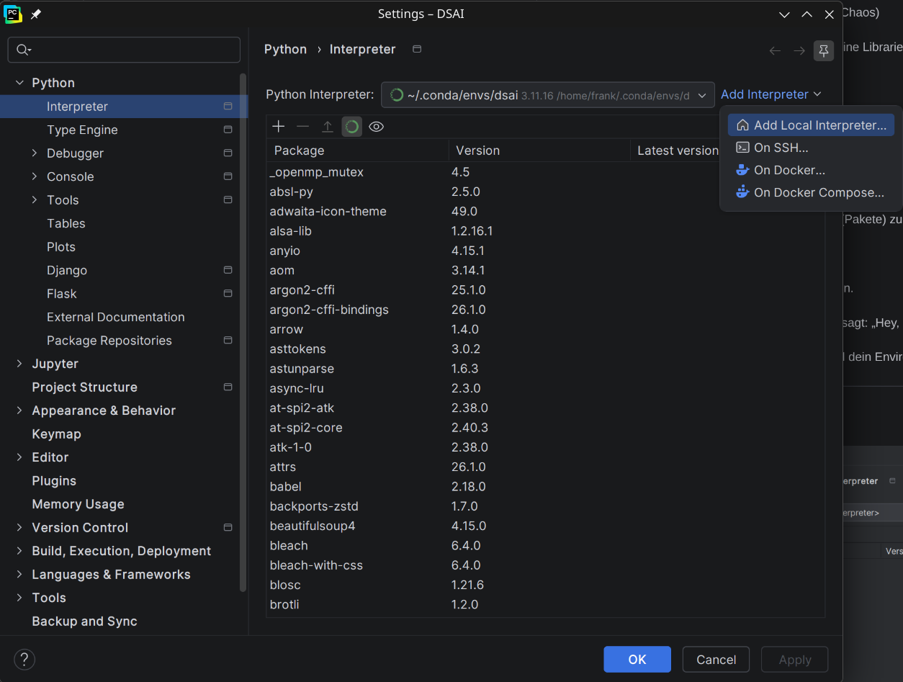
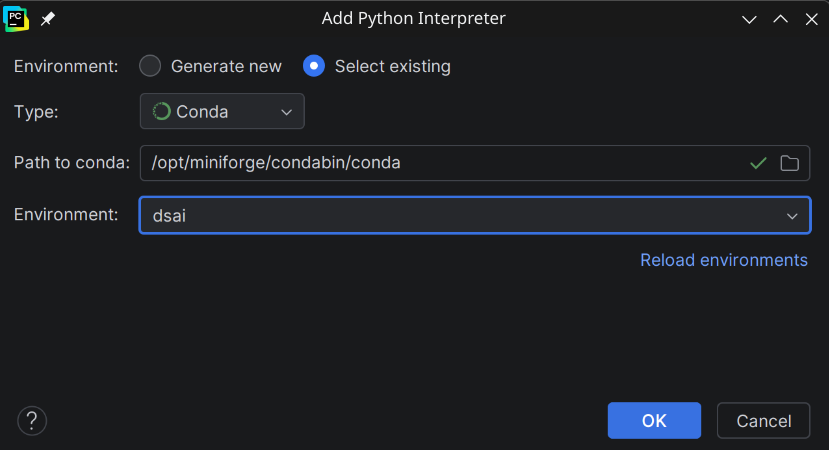
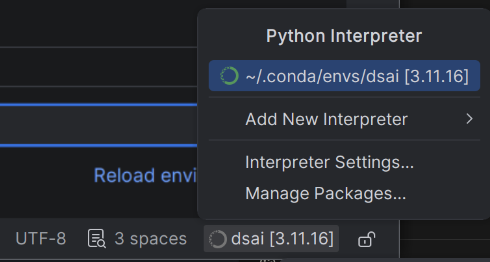

<ul style="list-style-type:circle;">
  <li>REFR - Prof. Franz Reichel</li>
  <li>DSAI - Data Science and Artificial Intelligence - 4XHIF</li>
</ul>

---

# Install Party

Am Ende dieser Anleitung hast du auf deinem Rechner:

- **Miniforge** – die Paketverwaltung `conda`
- ein **Environment `dsai`** mit numpy, pandas, matplotlib, seaborn, scikit-learn, graphviz und TensorFlow
- einen **Jupyter-Kernel**, der genau dieses Environment benutzt
- **PyCharm**, das auf dasselbe Environment zeigt

Zeitbedarf rund 45 Minuten, davon gut 20 Minuten Warten auf Downloads.

Alles, was sich zwischen den Betriebssystemen unterscheidet – Installation, Shell, Pfade – ist nach **Windows / Linux / macOS** getrennt. Such dir dein System und arbeite nur diesen Block ab.

Ab Schritt 4 arbeitest du nur noch mit `conda` und Python. Diese Befehle sind auf allen Systemen identisch; unterschiedlich ist dann nur noch, in welchem Fenster du sie eintippst.

---

## Schritt 0 – Vorbereitung

Drei Dinge, die sich im Nachhinein nur schwer reparieren lassen.

**Speicherplatz.** Das Environment belegt rund 4 GB. Mit Downloads und Cache solltest du 6 GB frei haben.

**Pfad.** Projektordner und Miniforge-Installation dürfen keine Umlaute und keine Leerzeichen enthalten, und sie dürfen nicht in einem Cloud-Ordner liegen.

### Windows

- Gut: `C:\dev\dsai`
- Schlecht: `C:\Users\Müller\OneDrive\Meine Projekte\DSAI`

OneDrive ist der häufigste Grund für kaputte Environments unter Windows: die Synchronisierung sperrt Dateien, während conda sie gerade schreibt.

### Linux

- Gut: `/home/franz/dsai`
- Schlecht: `/home/franz/Meine Übungen/DSAI`

### macOS

- Gut: `/Users/franz/dsai`
- Schlecht: `/Users/franz/Library/Mobile Documents/com~apple~CloudDocs/DSAI`

Der zweite Pfad ist iCloud Drive – dasselbe Problem wie OneDrive unter Windows.

**Alte Installationen.** Anaconda oder Miniconda kommen sich mit Miniforge technisch nicht in die Quere, aber zwei conda-Installationen parallel sind eine dauerhafte Fehlerquelle – man aktiviert dann irgendwann das Environment der falschen Installation. Wenn kein laufendes Projekt daran hängt: vorher deinstallieren.

---

## Schritt 1 – Miniforge installieren

Wir verwenden **Miniforge** statt Anaconda. Das ist dieselbe `conda`-Software, aber schlank und mit `conda-forge` als einzigem Paketkanal – genau dem Kanal, aus dem wir ohnehin alles beziehen.

Alle Installationsdateien liegen auf der [Miniforge-Releases-Seite](https://github.com/conda-forge/miniforge/releases/latest).

### Windows

Von der Releases-Seite die Datei **`Miniforge3-Windows-x86_64.exe`** herunterladen und ausführen.

Im Installer:

1. **"Just Me"** wählen
2. Den vorgeschlagenen Pfad übernehmen (`C:\Users\<du>\miniforge3`)
3. Die Häkchen auf der letzten Seite so lassen, wie sie vorgeschlagen werden

> Alternativ per winget in der PowerShell, falls dir das lieber ist:
> ```powershell
> winget install --id CondaForge.Miniforge3 -e
> ```

### Linux

Von der Releases-Seite die Datei **`Miniforge3-Linux-x86_64.sh`** herunterladen und im Terminal ausführen:

```bash
bash ~/Downloads/Miniforge3-Linux-x86_64.sh
```

Die Frage *"Do you wish to update your shell profile to automatically initialize conda?"* mit **yes** beantworten. Danach Terminal schließen und neu öffnen.

> Auf Arch-basierten Systemen (CachyOS, EndeavourOS, Manjaro) geht es auch über die Paketverwaltung:
> ```bash
> paru -S miniforge
> ```
> Das Paket kommt aus dem AUR und installiert nach `/opt/miniforge`, nicht ins Home-Verzeichnis. `conda` ist danach noch nicht im PATH – siehe Schritt 2.

### macOS

Von der Releases-Seite die passende Datei herunterladen:

- Apple Silicon (M1 bis M4): **`Miniforge3-MacOSX-arm64.sh`**
- ältere Intel-Macs: **`Miniforge3-MacOSX-x86_64.sh`**

Welchen Chip du hast, steht unter  → *Über diesen Mac*. Dann im Terminal:

```bash
bash ~/Downloads/Miniforge3-MacOSX-arm64.sh
```

Die Frage *"Do you wish to update your shell profile to automatically initialize conda?"* mit **yes** beantworten. Danach Terminal schließen und neu öffnen.

---

## Schritt 2 – Shell vorbereiten

### Windows

Im Startmenü gibt es jetzt den Eintrag **"Miniforge Prompt"**. Darin ist conda bereits aktiv. **Alle folgenden Befehle laufen in diesem Fenster.**

Wer stattdessen die normale PowerShell oder das PyCharm-Terminal verwenden möchte, führt einmalig im Miniforge Prompt aus:

```powershell
conda init powershell
```

> **Prüfpunkt** — Miniforge Prompt öffnen:
> ```powershell
> conda --version
> ```
> Es muss `conda` plus eine Versionsnummer erscheinen.

### Linux

Wenn du beim Installer "yes" gewählt hast, ist nichts weiter zu tun – Terminal neu öffnen genügt.

Sonst, oder bei einer anderen Shell:

```bash
conda init bash     # oder: conda init zsh
conda init fish     # auf CachyOS oft die Standard-Shell
```

Bei der Installation über `paru` liegt conda unter `/opt/miniforge` und ist noch nicht im PATH. `conda` einmalig über den vollen Pfad aufrufen – der Befehl schreibt dann die Konfiguration für deine Shell:

```bash
/opt/miniforge/bin/conda init bash     # bzw. zsh oder fish
```

Danach Terminal schließen und neu öffnen.

Falls das Paket bei dir woanders installiert, findest du den Pfad so:

```bash
pacman -Ql miniforge | grep -E '/bin/conda$'
```

Das `$` steht für Zeilenende – ohne das bekommst du auch `conda-env`, `conda-content-trust` und ein paar Dutzend weitere Treffer. Und weil `.` in einem regulären Ausdruck *jedes beliebige Zeichen* bedeutet, sucht man wörtliche Dateinamen besser mit `grep -F 'conda.sh'` statt `grep conda.sh` – sonst passt das Muster auch auf Pfade wie `conda/shell/`.

Das funktioniert auch aus fish heraus, obwohl fish keine `.sh`-Dateien lesen kann: `conda init fish` muss nicht *in* fish laufen, es legt nur die Datei `~/.config/fish/conf.d/conda.fish` an. Das Argument sagt conda, für welche Shell geschrieben werden soll.

> **Prüfpunkt** — neues Terminal öffnen:
> ```bash
> conda --version
> ```
> Es muss `conda` plus eine Versionsnummer erscheinen.

### macOS

Wenn du beim Installer "yes" gewählt hast, ist nichts weiter zu tun – Terminal neu öffnen genügt.

Sonst:

```bash
conda init zsh      # Standard seit macOS Catalina
```

> **Prüfpunkt** — neues Terminal öffnen:
> ```bash
> conda --version
> ```
> Es muss `conda` plus eine Versionsnummer erscheinen.

Kommt in einem der drei Fälle *"conda: command not found"* bzw. *"Die Benennung conda wurde nicht erkannt"*, siehe Troubleshooting weiter unten.

---

## Schritt 3 – environment.yml anlegen

Statt einer langen `conda install`-Zeile beschreiben wir das Environment in einer Datei. Damit bekommt die ganze Klasse exakt dasselbe Setup, und ein kaputtes Environment ist in zehn Minuten neu gebaut.

Dieser Schritt ist auf allen drei Systemen identisch: Lege im Projektordner eine Datei namens **`environment.yml`** an mit diesem Inhalt.

```yaml
name: dsai

channels:
  - conda-forge

dependencies:
  - python=3.11
  - jupyterlab
  - notebook
  - ipykernel
  - numpy
  - pandas
  - matplotlib
  - seaborn
  - scikit-learn
  - scikit-image
  - python-graphviz
  - pillow
  - scipy
  - scipy-stubs
  - pip
  - pip:
      - tensorflow==2.21.*
```

**Achtung bei YAML:** Eingerückt wird ausschließlich mit **Leerzeichen**, niemals mit Tab. Ein einzelner Tab erzeugt eine Fehlermeldung, die so aussieht, als wäre ein Paketname falsch. Und die sechs Leerzeichen vor `- tensorflow` sind kein Zufall – die Zeile gehört unter `- pip:`, nicht auf die Ebene darüber.

Was die Zeilen bedeuten:

| Zeile | Bedeutung |
| --- | --- |
| `name` | Unter diesem Namen aktivierst du das Environment später |
| `channels` | Woher die Pakete kommen. Nur conda-forge, kein Mischbetrieb |
| `python=3.11` | Bewusst nicht die neueste Version – TensorFlow hinkt Python immer ein bis zwei Versionen hinterher |
| `ipykernel` | Nötig, damit Jupyter dieses Environment überhaupt anbieten kann |
| `python-graphviz` | Bringt das Python-Modul **und** das Programm `dot` mit. Ein separater Graphviz-Installer ist damit nicht nötig |
| `pillow` | Bilder öffnen und in Arrays umwandeln. Kam bisher nur zufällig als Abhängigkeit mit |
| `scipy-stubs` | Nur Typinformationen für den Editor, kein ausführbarer Code. Ohne das Paket schlägt PyCharm die Installation von selbst vor |
| `pip:` | TensorFlow kommt per pip, weil das der einzige von Google offiziell unterstützte Weg ist |

---

## Schritt 4 – Environment erzeugen

Ab hier sind alle Befehle **auf allen drei Systemen identisch** – conda verhält sich überall gleich. Unterschiedlich ist nur, *wo* du sie eingibst:

- **Windows:** im „Miniforge Prompt"
- **Linux und macOS:** im Terminal

Wechsle dort zuerst in deinen Projektordner, also dorthin, wo die `environment.yml` liegt.

Der erste Befehl ist ein Trockenlauf: er prüft die Datei und löst alle Abhängigkeiten auf, installiert aber noch nichts. Läuft er ohne Fehler durch, folgen die beiden echten Befehle.

```
conda env create -f environment.yml --dry-run
conda env create -f environment.yml
conda activate dsai
```

Der erste Durchlauf dauert je nach Internetverbindung 5 bis 15 Minuten.

> **Prüfpunkt**
> ```
> conda env list
> ```
> `dsai` steht in der Liste, das aktive Environment ist mit `*` markiert. Im Prompt siehst du `(dsai)` am Zeilenanfang.

**Eine Regel für später:** In diesem Environment wurde zuerst mit conda und danach mit pip installiert. Diese Reihenfolge muss so bleiben. Ein nachträgliches `conda install irgendwas` in `dsai` kann Bibliotheken austauschen, auf denen die pip-Pakete aufbauen – daher kommt der `mkl_intel_thread.2.dll`-Fehler aus der Troubleshooting-Tabelle. Wenn du etwas nachinstallieren willst, trag es in die `environment.yml` ein und baue das Environment neu.

---

## Schritt 5 – Jupyter-Kernel registrieren

Damit Jupyter das Environment anbietet, muss es einmalig registriert werden. Auch das ist auf allen drei Systemen gleich – Windows im „Miniforge Prompt", Linux und macOS im Terminal.

```
conda activate dsai
python -m ipykernel install --user --name dsai --display-name "Python (dsai)"
```

> **Prüfpunkt**
> ```
> jupyter kernelspec list
> ```
> In der Ausgabe steht eine Zeile mit `dsai` und einem Pfad.

Warum dieser Schritt nötig ist, steht weiter unten unter *Conda-Environment vs. Jupyter-Kernel*.

---

## Schritt 6 – PyCharm einrichten

> **Hinweis:** Wir sind von DataSpell auf PyCharm umgestiegen. JetBrains hat DataSpell im Mai 2026 abgekündigt, 2026.1 ist die letzte Version. Wer DataSpell bereits installiert hat, kann es im laufenden Schuljahr weiterverwenden – neue Installationen bitte mit PyCharm.

**Installation** über die [JetBrains Toolbox](https://www.jetbrains.com/toolbox-app/) oder direkt von der [PyCharm-Downloadseite](https://www.jetbrains.com/pycharm/download/).

**Lizenz:** Für die Jupyter-Unterstützung brauchst du die Professional-Funktionen. Als Schülerin oder Schüler bekommst du die kostenlos über das [JetBrains-Education-Programm](https://www.jetbrains.com/community/education/) – Anmeldung mit der Schul-E-Mail-Adresse.

**Environment verbinden.** Wichtig ist die Reihenfolge im Dialog: Erst sagst du PyCharm, dass ein **vorhandenes** Environment verwendet werden soll, dann *welche Sorte*, dann *wo conda liegt* – und erst danach kann PyCharm die Environments überhaupt auflisten.

**1.** Projektordner in PyCharm öffnen

**2.** *Settings* → *Python* → *Interpreter*

**3.** Oben rechts auf *Add Interpreter* → *Add Local Interpreter…*



*Die Paketliste in der Mitte zeigt später, was im gewählten Environment installiert ist – eine bequeme Kontrolle, ob wirklich `dsai` aktiv ist.*

**4.** Bei *Environment* auf **Select existing** umstellen – nicht *Generate new*, das Environment gibt es ja schon

**5.** Bei *Type* **Conda** auswählen

**6.** Bei *Path to conda* den Pfad eintragen:

- **Windows:** `C:\Users\<du>\miniforge3\Scripts\conda.exe`
- **Linux:** `~/miniforge3/condabin/conda` — bei Installation über `paru`: `/opt/miniforge/condabin/conda`
- **macOS:** `~/miniforge3/condabin/conda`

Stimmt der Pfad, erscheint rechts im Feld ein grüner Haken.

**7.** Bei *Environment* aus der Liste **dsai** auswählen. Bleibt die Liste leer, einmal auf *Reload environments* klicken – und wenn sie dann immer noch leer ist, stimmt der conda-Pfad nicht.

**8.** Mit OK bestätigen



*So sieht der fertig ausgefüllte Dialog aus – hier mit dem `/opt`-Pfad einer Installation über `paru`.*

> **Prüfpunkt** — unten rechts in der Statusleiste von PyCharm steht jetzt `dsai [3.11.x]`. Ein Klick darauf zeigt den vollständigen Pfad des Environments.



Der Pfad lautet dort `~/.conda/envs/dsai`. Das ist normal: conda legt Environments im Home-Verzeichnis an, sobald das Installationsverzeichnis nicht beschreibbar ist – bei der Installation nach `/opt` also immer.

---

## Schritt 7 – Smoketest

Neues Notebook anlegen, als Kernel **Python (dsai)** wählen. Die folgenden drei Zellen sind auf allen Systemen gleich.

**Zelle 1 – sind alle Pakete da?**

```python
import sys, importlib.metadata as md

print("Python:", sys.version.split()[0])
for paket in ["numpy", "pandas", "matplotlib", "seaborn",
              "scikit-learn", "scikit-image", "graphviz", "pillow",
              "scipy", "tensorflow"]:
    try:
        print(f"  {paket:15s} {md.version(paket)}")
    except md.PackageNotFoundError:
        print(f"  {paket:15s} FEHLT")
```

Alle zehn Zeilen müssen eine Versionsnummer zeigen. Steht irgendwo `FEHLT`, stimmt etwas mit dem Environment oder dem Kernel nicht.

**Zelle 2 – findet Python auch das Programm Graphviz, nicht nur das Modul?**

```python
import shutil, graphviz

print("dot-Programm:", shutil.which("dot"))

g = graphviz.Digraph()
g.edge("Installation", "läuft")
g.render("graphviz_test", format="png", cleanup=True)
g
```

Erwartet: `dot-Programm:` zeigt einen Pfad (nicht `None`), im Projektordner liegt danach die Datei `graphviz_test.png`, und im Notebook erscheint ein kleines Diagramm mit zwei Kästchen.

**Wenn scheinbar gar nichts passiert**, läuft der Code nicht in einem Notebook, sondern in einem `.py`-Skript oder in der Python-Konsole. Das `g` in der letzten Zeile ist nämlich kein `print` – es wird nur angezeigt, weil Jupyter das Ergebnis der letzten Zeile automatisch darstellt. Das Bild wurde trotzdem erzeugt. Zwei Wege, es anzusehen:

- `graphviz_test.png` im PyCharm-Projektbaum doppelklicken
- oder `view=True` ergänzen, dann öffnet sich der Bildbetrachter des Systems:

```python
g.render("graphviz_test", format="png", view=True, cleanup=True)
```

**Wenn `ExecutableNotFound` kommt** oder bei `dot-Programm` ein `None` steht, ist nur das Python-Modul installiert und das Programm `dot` fehlt – siehe Troubleshooting.

> **Nebenbei:** Lass `cleanup=True` einmal weg. Dann bleibt neben der PNG auch eine Datei `graphviz_test` ohne Endung liegen – das ist der DOT-Quelltext, den graphviz aus deinem Python-Objekt erzeugt hat:
>
> ```dot
> digraph {
> 	Installation -> "läuft"
> }
> ```
>
> Damit sieht man gut, was `graphviz.Digraph()` eigentlich tut: es erzeugt nur Text. Gezeichnet wird erst durch das Programm `dot`.

**Zelle 3 – TensorFlow**

```python
import tensorflow as tf

print(tf.__version__)
print(tf.reduce_sum(tf.random.normal([1000, 1000])).numpy())
```

Erwartet werden zwei Ausgaben: die Versionsnummer `2.21.0` und eine Zufallszahl irgendwo um die ±500.

**Davor steht ein ganzer Schwall Meldungen. Der ist normal.** So sieht ein erfolgreicher Lauf auf einem Rechner ohne NVIDIA-Grafikkarte aus:

```
WARNING: All log messages before absl::InitializeLog() is called are written to STDERR
I0000 ... cudart_stub.cc:31] Could not find cuda drivers on your machine, GPU will not be used.
I0000 ... cpu_feature_guard.cc:227] This TensorFlow binary is optimized to use available CPU
        instructions in performance-critical operations.
2.21.0
E0000 ... cuda_executor.cc:1737] INTERNAL: CUDA Runtime error: Failed call to
        cudaGetRuntimeVersion: Error loading CUDA libraries. GPU will not be used.
W0000 ... cuda_executor.cc:1755] Failed to determine cuDNN version ...
W0000 ... gpu_device.cc:2365] Cannot dlopen some GPU libraries ...
Skipping registering GPU devices...
-501.08356
```

Der Buchstabe am Zeilenanfang ist die Dringlichkeitsstufe: `I` = Information, `W` = Warnung, `E` = Error. Und ja, TensorFlow stuft „ich finde keine GPU" tatsächlich als *Error* ein – das ist unschön gewählt, aber harmlos. Sämtliche Meldungen oben sagen dasselbe: es wurde nach CUDA gesucht und nichts gefunden, also wird auf der CPU gerechnet. Genau das wollen wir.

**Der Test ist bestanden, wenn am Ende eine Versionsnummer und eine Zahl stehen.** Alles davor kannst du ignorieren.

Wer es ruhiger mag, kann die Meldungen vor dem Import abschalten:

```python
import os
os.environ["TF_CPP_MIN_LOG_LEVEL"] = "2"   # 2 = I und W weg, 3 = auch E weg

import tensorflow as tf
```

Die Zeile muss **vor** `import tensorflow` stehen, sonst wirkt sie nicht. Im Unterricht würde ich bei `2` bleiben – Stufe `3` verschluckt auch echte Fehler.

Warum wir überhaupt auf der CPU rechnen, steht in Anhang B.

---

## Troubleshooting

| Meldung / Symptom | System | Ursache | Lösung |
| --- | --- | --- | --- |
| *"Die Benennung conda wurde nicht erkannt"* | Windows | Die PowerShell kennt conda nicht | „Miniforge Prompt" verwenden oder einmal `conda init powershell` |
| *"...cannot be loaded because running scripts is disabled on this system"* | Windows | Die Ausführungsrichtlinie blockiert das conda-Profil | Einmalig `Set-ExecutionPolicy -ExecutionPolicy RemoteSigned -Scope CurrentUser` |
| `conda: command not found` | Linux, macOS | Shell wurde nicht initialisiert | `conda init bash` / `zsh` / `fish`, danach Terminal neu öffnen |
| `conda: command not found` nach `paru -S miniforge` | Linux | Das Paket installiert nach `/opt/miniforge` und bindet sich nicht selbst ein | Einmalig `/opt/miniforge/bin/conda init <shell>`, danach Terminal neu öffnen |
| `ResolvePackageNotFound` | alle | Die yml enthält plattformspezifische Pakete oder Build-Nummern | Die yml aus Schritt 3 verwenden. Ein mit `conda env export` erzeugtes File läuft nur auf dem Rechner, auf dem es entstanden ist |
| `CondaHTTPError: HTTP 000 CONNECTION FAILED` | alle | Schulnetz oder Proxy blockiert den Download | Anderes Netz probieren (Handy-Hotspot), sonst Proxy in `~/.condarc` eintragen |
| *Solving environment* läuft endlos | alle | Veraltete conda-Version | `conda update -n base -c conda-forge conda` |
| Kernel „Python (dsai)" fehlt in Jupyter | alle | ipykernel wurde nicht registriert | Schritt 5 wiederholen, **mit aktiviertem** dsai-Environment |
| `ModuleNotFoundError: No module named 'pandas'`, obwohl installiert | alle | Das Notebook läuft im falschen Kernel | Oben rechts im Notebook den Kernel auf `Python (dsai)` umstellen |
| `INTEL oneMKL ERROR ... mkl_intel_thread.2.dll` | Windows | conda und pip sind sich im selben Environment in die Quere gekommen | `conda install mkl mkl-service --force-reinstall`, danach die Reihenfolgeregel aus Schritt 4 einhalten |
| `graphviz.ExecutableNotFound` | alle | Nur das Python-Modul da, das Programm `dot` fehlt | Prüfen, ob wirklich `python-graphviz` in der yml steht (nicht `graphviz`), Environment neu bauen |
| Unerklärliche Dateifehler beim Anlegen | Windows, macOS | OneDrive- bzw. iCloud-Pfad oder Umlaute | Siehe Schritt 0 |

**Wenn gar nichts hilft:** Environment wegwerfen und neu bauen dauert zehn Minuten und repariert die allermeisten Fälle.

```
conda deactivate
conda remove -n dsai --all
conda env create -f environment.yml
```

---

## Unterschied: Conda-Environment vs. Jupyter-Kernel

Der Punkt, der am Anfang am meisten verwirrt.

**Das Conda-Environment** ist ein Container für eine bestimmte Python-Version und einen bestimmten Satz Pakete. Es arbeitet unabhängig von allen anderen Environments – dadurch kein Paket-Chaos zwischen Projekten.

> Vergleichbar mit einer Werkzeugkiste, in der deine Bibliotheken liegen.

**Der Jupyter-Kernel** ist der Prozess, der deinen Code tatsächlich ausführt. Er lädt ein bestimmtes Python aus einem bestimmten Environment. Ohne Kernel weiß Jupyter nicht, mit welchem Python es rechnen soll.

> Vergleichbar mit dem Motor, der die Werkzeuge zum Laufen bringt.

**Warum beides?** Das Environment ist zunächst nur eine Sammlung von Dateien auf der Festplatte. Erst durch das Registrieren mit `ipykernel install` erfährt Jupyter, dass es dieses Environment überhaupt gibt.

Praktische Konsequenz: Wenn ein `import` fehlschlägt, obwohl das Paket nachweislich installiert ist, läuft dein Notebook fast immer im falschen Kernel.

---

## Anhang A – conda-Befehle

Diese Befehle sind auf Windows, Linux und macOS identisch.

```
# Environments anzeigen
conda env list

# Wechseln
conda activate dsai
conda deactivate

# Was ist installiert?
conda list
conda list numpy

# Environment löschen
conda remove -n dsai --all

# Environment exportieren – siehe Warnung unten
conda env export --from-history > environment.yml

# conda selbst aktualisieren
conda update -n base -c conda-forge conda
```

Zum Export: `conda env export` **ohne** `--from-history` schreibt exakte Build-Nummern und plattformspezifische Pakete mit hinein. So ein File lässt sich auf einem anderen Betriebssystem nicht mehr installieren – es scheitert mit `ResolvePackageNotFound`. Für den Austausch in der Klasse gilt deshalb: die handgeschriebene yml aus Schritt 3 ist die Referenz.

---

## Anhang B – GPU-Support

Kurzfassung: **für diesen Kurs brauchst du keine GPU.** Die Datensätze im Unterricht trainieren auf einer normalen CPU in Sekunden bis wenigen Minuten; MNIST mit einem kleinen Netz liegt unter einer Minute.

Falls dich der aktuelle Stand trotzdem interessiert – bei TensorFlow hat sich hier seit 2022 einiges geändert:

| System | GPU mit TensorFlow | Weg |
| --- | --- | --- |
| Windows nativ | **nein** | TensorFlow 2.10 war die letzte Version mit GPU-Support unter Windows |
| Windows + WSL2 | ja, NVIDIA | In WSL2 `pip install "tensorflow[and-cuda]"`, dazu NVIDIA-Treiber ab 528.33 unter Windows |
| Linux | ja, NVIDIA | `pip install "tensorflow[and-cuda]"`, Treiber ab 525.60.13 |
| macOS Apple Silicon | nein | Rechnet auf der CPU |
| macOS Intel | nein | Letzte unterstützte Version war TensorFlow 2.16 |

Zwei Anleitungen kursieren im Netz noch massenhaft und sind heute schlicht falsch:

- **`pip install tensorflow-gpu`** funktioniert nicht mehr. Das Paket wurde 2023 durch einen leeren Platzhalter ersetzt, der die Installation mit *"Removed: please install 'tensorflow' instead"* abbricht. GPU-Unterstützung steckt seit TensorFlow 2.1 im normalen `tensorflow`-Paket.
- **`conda install cudatoolkit=11.2 cudnn=8.1.0`** war der Weg für TensorFlow 2.5 im Jahr 2021. Aktuelle Versionen bringen die passenden CUDA-Bibliotheken über `tensorflow[and-cuda]` selbst mit.

Wer unter Windows unbedingt die GPU nutzen möchte, hat drei Optionen: WSL2 als einzigen von Google unterstützten Weg, PyTorch statt TensorFlow (dort läuft CUDA nach wie vor nativ unter Windows), oder das DirectML-Plugin von Microsoft, das auch AMD- und Intel-GPUs anspricht, aber auf einem alten TensorFlow-Stand hängt.

---

*Stand: September 2026 — TensorFlow 2.21, Python 3.11, Miniforge 26.x, PyCharm 2026.x*
