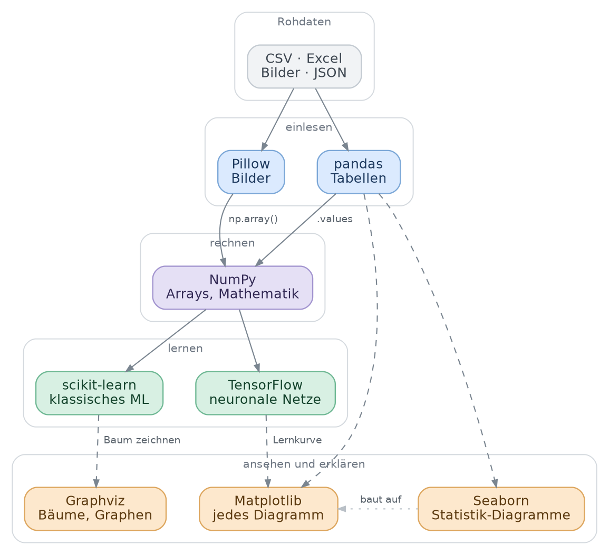

<ul style="list-style-type:circle;">
  <li>REFR - Prof. Franz Reichel</li>
  <li>DSAI - Data Science and Artificial Intelligence - 4XHIF</li>
</ul>

---

# Packages – die Landkarte

Diese Seite soll zwei Fragen beantworten: *Was war dieses Paket noch mal?* und *Wofür brauche ich es überhaupt?*

Die ausführliche Behandlung steht jeweils im eigenen Kapitel – hier gibt es nur den Überblick und je ein paar Zeilen Code zum Wiedererkennen.

---

## Wie die Pakete zusammenspielen



Von oben nach unten gelesen: Rohdaten werden **eingelesen**, in Zahlen **umgerechnet**, ein Modell **lernt** daraus, und am Ende wird das Ergebnis **angesehen**. Die durchgezogenen Pfeile sind der Hauptweg, die gestrichelten führen zur Darstellung.

Zwei Dinge, die man an dem Bild ablesen kann und die immer wieder für Verwirrung sorgen:

- **NumPy ist die Mitte.** Egal ob die Daten aus einer Tabelle oder aus einem Bild kommen – am Ende landen sie als NumPy-Array beim Modell. Alle anderen Pakete bauen darauf auf.
- **Seaborn ist kein Ersatz für Matplotlib**, sondern eine Abkürzung darüber. Jedes Seaborn-Diagramm ist innen drin ein Matplotlib-Diagramm und lässt sich auch mit Matplotlib-Befehlen weiterbearbeiten.

---

## Auf einen Blick

| Paket | Wofür | Kapitel |
| --- | --- | --- |
| **NumPy** | Arrays und Mathematik – das Fundament | `04_Numpy` |
| **pandas** | Tabellen laden, filtern, gruppieren | `06_Pandas` |
| **Matplotlib** | Diagramme, volle Kontrolle über jedes Detail | `05_Matplotlib` |
| **Seaborn** | statistische Diagramme in einer Zeile | `08_Seaborn` |
| **Pillow** | Bilder öffnen und in Zahlen verwandeln | Notebooks `10_2`, `10_3`, `10_5` |
| **scikit-learn** | klassisches Machine Learning | `12_1` bis `12_3` |
| **TensorFlow / Keras** | neuronale Netze | `11_*` |
| **Graphviz** | Bäume und Graphen zeichnen | `12_*` |
| **scikit-image** | Bildverarbeitung: Kanten, Filter, Formen | – |
| *Jupyter* | die Umgebung, in der das alles läuft | `02_JupyterNotebook` |
| *conda-forge* | der Kanal, aus dem alle Pakete kommen | `00_InstallParty` |

---

## Welches Werkzeug für welche Frage

| Ich will … | dann nimm |
| --- | --- |
| eine CSV- oder Excel-Datei einlesen und durchsehen | pandas |
| mit Zahlen, Vektoren oder Matrizen rechnen | NumPy |
| ein Diagramm bauen, das genau so aussieht, wie ich es will | Matplotlib |
| schnell Verteilungen vergleichen oder Korrelationen sehen | Seaborn |
| ein Bild in Zahlen verwandeln, damit ein Modell damit rechnen kann | Pillow |
| ein Modell trainieren, testen und bewerten | scikit-learn |
| ein neuronales Netz selbst bauen | TensorFlow / Keras |
| einen Entscheidungsbaum als Bild ausgeben | Graphviz |
| Kanten oder Formen in einem Bild finden | scikit-image |

---

## Die üblichen Abkürzungen

Diese Kurznamen sind keine Vorschrift, aber weltweit Konvention. Halte dich daran – jeder fremde Code, den du liest, macht es auch so.

```python
import numpy as np
import pandas as pd
import matplotlib.pyplot as plt
import seaborn as sns
```

---

## NumPy

Das Fundament. NumPy bringt den Datentyp **Array** mit: eine Liste, die nur Zahlen enthält, dafür aber sehr schnell ist und sich als Ganzes berechnen lässt.

Wofür du es brauchst:

- rechnen mit ganzen Zahlenreihen, ohne eine Schleife zu schreiben
- Matrizen, wie sie in jedem neuronalen Netz vorkommen
- Zufallszahlen für Testdaten

```python
import numpy as np

a = np.array([1, 2, 3, 4])

a * 2           # array([2, 4, 6, 8])   – jedes Element, ohne Schleife
a.mean()        # 2.5
np.zeros((3, 3))            # 3×3-Matrix voller Nullen
np.random.normal(0, 1, 100) # 100 normalverteilte Zufallszahlen
```

Der Unterschied zur normalen Python-Liste ist der Punkt: `[1,2,3] * 2` hängt die Liste an sich selbst, `np.array([1,2,3]) * 2` verdoppelt jede Zahl.

→ Kapitel `04_Numpy`

---

## pandas

Der Tabellen-Werkzeugkasten. Das zentrale Objekt heißt **DataFrame** und verhält sich wie ein Excel-Blatt, mit dem man programmieren kann.

Wofür du es brauchst:

- Daten aus CSV, Excel, JSON oder einer Datenbank hereinholen
- filtern, sortieren, fehlende Werte behandeln
- gruppieren und zusammenfassen – die Pivot-Tabelle in Code

```python
import pandas as pd

df = pd.read_csv("daten.csv")

df.head()                          # erste fünf Zeilen
df.info()                          # Spalten, Datentypen, fehlende Werte
df[df["Preis"] > 100]              # nur die teuren Zeilen
df.groupby("Kategorie")["Preis"].mean()
```

→ Kapitel `06_Pandas`, `06_Pandas_Dataframe`, `06_Pandas_Pivot_Tables`

---

## Matplotlib

Das Zeichenprogramm unter allem. Fast jede Grafik, die du in Python siehst, ist am Ende Matplotlib – auch die von Seaborn und pandas.

Wofür du es brauchst:

- jede Art von Diagramm: Linie, Balken, Streuung, Histogramm
- Beschriftungen, Achsen, Farben, Legenden bis ins Detail einstellen
- Bilder anzeigen (`imshow`), zum Beispiel Ziffern aus MNIST

```python
import matplotlib.pyplot as plt
x = [1,2,3]
y = [21,22,23]

plt.plot(x, y)
plt.xlabel("Zeit in s")
plt.ylabel("Temperatur in °C")
plt.title("Messreihe")
plt.show()
```

Matplotlib ist wortreich, aber es kann alles. Wenn ein Seaborn-Diagramm fast passt und nur die Beschriftung stört, korrigierst du sie mit Matplotlib.

→ Kapitel `05_Matplotlib`

---

## Seaborn

Die Abkürzung über Matplotlib. Seaborn kennt DataFrames und macht aus einer Zeile Code ein statistisch sinnvolles Diagramm.

Wofür du es brauchst:

- Verteilungen vergleichen: Boxplot, Violinplot, Histogramm
- Zusammenhänge sehen: Streudiagramm mit Regressionsgerade
- Korrelationen als Heatmap

```python
import seaborn as sns

sns.boxplot(data=df, x="Kategorie", y="Preis")
sns.heatmap(df.corr(numeric_only=True), annot=True)
sns.pairplot(df, hue="Klasse")     # alle Spalten gegen alle
```

→ Kapitel `08_Seaborn`, `08_Seaborn_Styles_and_Colors`

---

## Pillow

Die Bildbibliothek. Pillow öffnet Bilddateien und macht daraus etwas, mit dem NumPy und die Modelle rechnen können.

Wofür du es brauchst:

- Bilder öffnen, skalieren, drehen, in Graustufen umwandeln
- ein Bild in ein Array verwandeln – der Schritt, ohne den kein Modell ein Bild sieht

```python
from PIL import Image
import numpy as np

img = Image.open("apfel.jpg").convert("L").resize((28, 28))
arr = np.array(img)

arr.shape       # (28, 28)   – 784 Graustufenwerte von 0 bis 255
```

Genau das passiert in den Bildklassifikations-Notebooks: aus jedem Bild wird eine Zeile Zahlen, und für das Modell ist ein Apfel danach nichts anderes als eine besonders lange Zahlenreihe.

→ Notebooks `10_2_apple_orange_fruits360`, `10_3_mnist`, `10_5_unsupervised_fruits_kmeans`

---

## scikit-learn

Der Werkzeugkasten für klassisches Machine Learning. Dutzende fertige Verfahren, alle mit derselben Bedienung.

Wofür du es brauchst:

- Daten vorbereiten: aufteilen, skalieren, kodieren
- Modelle trainieren: Entscheidungsbaum, Random Forest, k-NN, SVM, Regression
- Modelle bewerten: Accuracy, Confusion Matrix, Cross-Validation
- Clustering ohne Zielwerte: k-Means

```python
from sklearn.model_selection import train_test_split
from sklearn.tree import DecisionTreeClassifier
from sklearn.metrics import accuracy_score

X_train, X_test, y_train, y_test = train_test_split(X, y, test_size=0.2)

modell = DecisionTreeClassifier(max_depth=3)
modell.fit(X_train, y_train)

accuracy_score(y_test, modell.predict(X_test))
```

Die große Stärke ist die **einheitliche API**: `fit`, `predict`, `score` funktionieren bei jedem Modell gleich. Ein anderes Verfahren auszuprobieren heißt, genau eine Zeile zu ändern.

→ Kapitel `12_1_sklearn`, `12_2_supervised_learning_basics`, `12_3_classfication_metrics`, `11_6_KlassifikationsModelle`

---

## TensorFlow / Keras

Die Bibliothek für neuronale Netze. **Keras** ist die freundliche Oberfläche darauf – man stapelt Schichten wie Bauklötze.

Wofür du es brauchst:

- ein Netz aus mehreren Schichten selbst zusammensetzen
- es trainieren und dabei beobachten, wie der Fehler sinkt
- Aufgaben, für die klassisches ML zu schwach ist, etwa Bilderkennung

```python
from tensorflow import keras

modell = keras.Sequential([
    keras.layers.Dense(16, activation="relu"),
    keras.layers.Dense(1,  activation="sigmoid"),
])

modell.compile(optimizer="adam", loss="binary_crossentropy", metrics=["accuracy"])
verlauf = modell.fit(X_train, y_train, epochs=20, validation_split=0.2)
```

Das `verlauf`-Objekt enthält Fehler und Genauigkeit pro Durchlauf – die Grundlage für die Lernkurve, an der man Überanpassung erkennt.

→ Kapitel `11_2_Perzeptron` bis `11_7`, dazu `11_5_TrainTestLoss`

---

## Graphviz

Ein Zeichenprogramm für Graphen: Du beschreibst nur, was womit verbunden ist, und Graphviz rechnet die Anordnung selbst aus.

Wofür du es brauchst:

- einen trainierten Entscheidungsbaum als Bild ausgeben – man sieht direkt, nach welchen Schwellwerten das Modell entscheidet
- Ablaufdiagramme und Zustandsautomaten

```python
from sklearn.tree import export_graphviz
import graphviz

dot = export_graphviz(modell, feature_names=X.columns,
                      class_names=["nein", "ja"], filled=True, rounded=True)
graphviz.Source(dot)
```

Graphviz besteht aus zwei Teilen: dem Python-Modul und dem eigentlichen Zeichenprogramm `dot`. Beide kommen über das conda-Paket `python-graphviz` – siehe `00_InstallParty`.

→ Kapitel `12_*`

---

## scikit-image

Bildverarbeitung jenseits von Öffnen und Skalieren: Filter, Kantenerkennung, Segmentierung.

```python
from skimage import io, color, filters

bild   = io.imread("blatt.jpg")
grau   = color.rgb2gray(bild)
kanten = filters.sobel(grau)
```

Während Pillow das Bild *bereitstellt*, *analysiert* scikit-image es.

---

## Jupyter

Kein Rechenwerkzeug, sondern die Umgebung, in der alles andere läuft. Ein **Notebook** ist eine einzelne Datei, in der Code, seine Ausgaben, Diagramme und erklärender Text nebeneinander stehen.

Wofür du es brauchst:

- Code **zellenweise** ausführen und dazwischen nachdenken. Variablen bleiben im Speicher, du musst nicht jedes Mal alles neu rechnen
- Diagramme direkt unter dem Code sehen, der sie erzeugt hat
- mit Markdown-Zellen erklären, *warum* du etwas gemacht hast – deshalb ist ein Notebook zugleich Programm und Protokoll

Genau diese Mischung macht es zum Standardwerkzeug in Datenanalyse, Forschung und Lehre. Für ein fertiges Programm, das jeden Tag läuft, nimmt man trotzdem eine normale `.py`-Datei.

Zwei Oberflächen für dasselbe: **JupyterLab** ist die neuere mit Dateibrowser und mehreren Reitern, das **klassische Notebook** die schlanke Variante. Beide sind in der `environment.yml`. In PyCharm brauchst du keine von beiden – die IDE öffnet `.ipynb`-Dateien direkt.

Der Begriff **Kernel** und der Unterschied zum Environment sind in `00_InstallParty` erklärt – das ist die häufigste Fehlerquelle überhaupt.

→ Kapitel `02_JupyterNotebook`, Installation in `00_InstallParty`

---

## Woher die Pakete kommen

**conda-forge** ist weder Programm noch Bibliothek, sondern ein **Kanal**: eine Quelle, aus der conda Pakete lädt. Dasselbe Paket kann es in mehreren Kanälen geben, gebaut von unterschiedlichen Leuten.

Warum wir diesen nehmen:

- von der Community gepflegt, mit Abstand die größte Auswahl
- meist deutlich aktueller als der Standardkanal von Anaconda
- keine kommerziellen Lizenzbedingungen, die an Schulen und in Firmen regelmäßig Thema sind

In der `environment.yml` steht er als einziger Eintrag unter `channels`. Auf der Kommandozeile entspricht das dem Flag `-c conda-forge`.

**Warum nur ein Kanal?** Pakete wie NumPy oder SciPy bestehen zum großen Teil aus kompiliertem C- und Fortran-Code. Jeder Kanal baut sie gegen seine eigenen Versionen der darunterliegenden Systembibliotheken. Mischt man Pakete aus zwei Kanälen, passen diese Fundamente nicht mehr zusammen – und das Ergebnis sind Abstürze, die wie Programmierfehler aussehen, obwohl dein Code stimmt. Der `mkl_intel_thread.2.dll`-Fehler in der Troubleshooting-Tabelle von `00_InstallParty` ist genau so ein Fall.

**conda oder pip?** Beide installieren Pakete, aber sie wissen nichts voneinander.

| | conda | pip |
| --- | --- | --- |
| installiert | Python-Pakete **und** Systembibliotheken (`dot`, CUDA, C-Bibliotheken) | nur Python-Pakete |
| Quelle | Kanäle wie conda-forge | PyPI |
| prüft Verträglichkeit | ja, über das ganze Environment | nur für das eine Paket |

Faustregel für diesen Kurs: **alles über conda, außer es geht nicht.** Bei uns ist TensorFlow der einzige Fall – dort ist pip der einzige von Google unterstützte Weg. Und wenn beides nötig ist, gilt die Reihenfolge: erst conda, dann pip, danach nichts mehr mit conda nachinstallieren.

→ Details und Befehle in `00_InstallParty`

---

## Pakete, die du nie importierst

Zwei Einträge in der `environment.yml` tauchen in keinem `import` auf – trotzdem gehören sie dazu.

**SciPy** kommt als Unterbau von scikit-learn ohnehin mit. Darin stecken die numerischen Verfahren, auf denen vieles aufsetzt: Optimierung, statistische Tests, Signalverarbeitung, dünn besetzte Matrizen. Du kannst es direkt verwenden, brauchst es im Kurs aber selten.

```python
from scipy import stats

stats.ttest_ind(gruppe_a, gruppe_b)   # Mittelwerte zweier Gruppen vergleichen
```

**scipy-stubs** enthält gar keinen ausführbaren Code, sondern nur Typinformationen zu SciPy – Angaben darüber, welche Datentypen eine Funktion erwartet und zurückgibt. PyCharm liest diese Dateien und kann dadurch besser vervollständigen und früher warnen. Genau deshalb schlägt die IDE die Installation von selbst vor. Für das Programm ändert sich nichts, nur für den Editor.

Die Versionsnummern der Stubs folgen denen von SciPy. In der `environment.yml` steht das Paket deshalb ohne feste Version – conda wählt die passende automatisch.

---

## Der typische Ablauf

1. **pandas** – Daten laden und aufräumen, oder **Pillow**, wenn es Bilder sind
2. **Matplotlib** und **Seaborn** – erst einmal ansehen, was man überhaupt hat
3. **NumPy** – in die Zahlenform bringen, die das Modell erwartet
4. **scikit-learn** oder **TensorFlow** – Modell trainieren
5. **scikit-learn** – bewerten: Wie gut ist es wirklich?
6. **Matplotlib** und **Seaborn** oder **Graphviz** – Ergebnis darstellen und erklären

Schritt 2 wird am häufigsten übersprungen und ist am häufigsten der, an dem man den Fehler in den Daten gefunden hätte.
