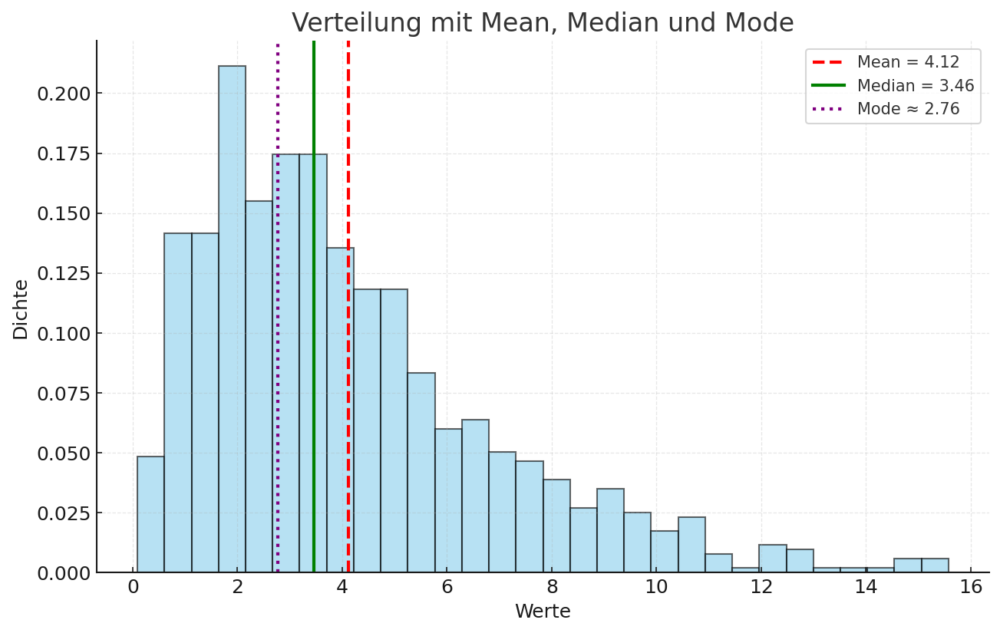
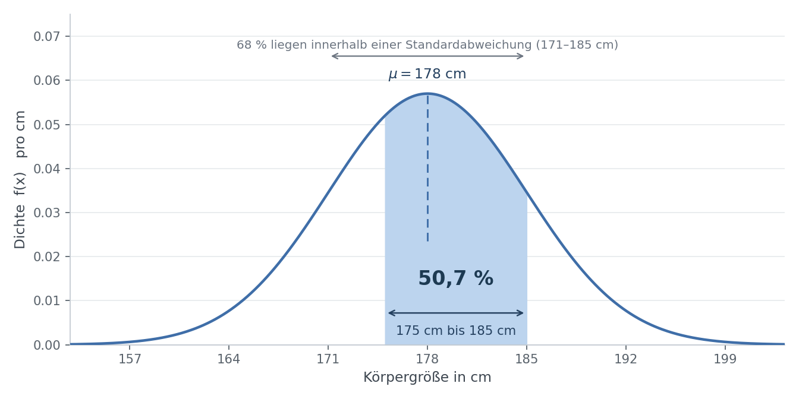

<ul style="list-style-type:circle;">
  <li>REFR - Prof. Franz Reichel</li>
  <li>DSAI - Data Science and Artificial Intelligence - 4XHIF</li>
</ul>

---

# Statistische Grundbegriffe

Ein Nachschlagewerk: Definition, Formel, ein Rechenbeispiel. Wer es genauer wissen will, folgt dem Wikipedia-Link beim jeweiligen Begriff — das ist ausdrücklich Teil der Übung.

Die englischen Bezeichnungen stehen bewusst dabei. In pandas, NumPy und scikit-learn heißen die Funktionen `mean`, `median`, `var` und `std`.

---

## Auf einen Blick

| Begriff | In einem Satz | Formel |
| --- | --- | --- |
| Mittelwert (mean) | Summe durch Anzahl | $\bar{x} = \frac{1}{n}\sum x_i$ |
| Median | Der mittlere Wert der sortierten Daten | — |
| Modalwert (mode) | Der häufigste Wert | — |
| Varianz (variance) | Mittlere quadratische Abweichung vom Mittelwert | $s^2 = \frac{1}{n}\sum (x_i - \bar{x})^2$ |
| Standardabweichung (standard deviation) | Wurzel der Varianz, in der Einheit der Daten | $s = \sqrt{s^2}$ |
| Dichtefunktion (PDF) | Beschreibt die Verteilung stetiger Daten | siehe unten |

Alle Beispiele auf dieser Seite rechnen mit denselben drei Werten: **2, 4, 6**.

---

## Mittelwert

[Wikipedia: Arithmetisches Mittel](https://de.wikipedia.org/wiki/Arithmetisches_Mittel)

Die Summe aller Werte, geteilt durch ihre Anzahl.

$$
\bar{x} = \frac{x_1 + x_2 + \dots + x_n}{n} = \frac{1}{n} \sum_{i=1}^{n} x_i
$$

**Beispiel** mit 2, 4, 6:

$$
\bar{x} = \frac{2 + 4 + 6}{3} = \frac{12}{3} = 4
$$

---

## Median

[Wikipedia: Median](https://de.wikipedia.org/wiki/Median)

Der Wert in der Mitte, wenn man alle Werte der Größe nach sortiert. Bei einer geraden Anzahl von Werten nimmt man den Mittelwert der beiden mittleren.

**Beispiele:**

| Werte | Median | |
| --- | --- | --- |
| 1, 3, 5 | **3** | ungerade Anzahl, der mittlere Wert |
| 1, 3, 5, 9 | **4** | gerade Anzahl, also $(3 + 5) / 2$ |

Der Median ist unempfindlich gegenüber Ausreißern — im Gegensatz zum Mittelwert. Genau darin liegt sein Nutzen.

---

## Modalwert

[Wikipedia: Modus](https://de.wikipedia.org/wiki/Modus_(Statistik))

Der Wert, der am häufigsten vorkommt. Es kann auch mehrere davon geben.

| Werte | Modalwert | |
| --- | --- | --- |
| 2, 2, 3, 4, 6 | **2** | kommt zweimal vor |
| 1, 2, 2, 3, 3 | **2 und 3** | bimodal |

---

## Varianz

[Wikipedia: Varianz](https://de.wikipedia.org/wiki/Varianz_(Stochastik))

Wie weit streuen die Werte um ihren Mittelwert? Man misst für jeden Wert den Abstand zum Mittelwert, quadriert ihn und mittelt über alle.

$$
s^2 = \frac{1}{n} \sum_{i=1}^{n} (x_i - \bar{x})^2
$$

Quadriert wird, damit sich Abweichungen nach oben und unten nicht gegenseitig aufheben.

**Beispiel** mit 2, 4, 6 und $\bar{x} = 4$:

| Wert | Abweichung | quadriert |
| --- | --- | --- |
| 2 | $-2$ | 4 |
| 4 | $0$ | 0 |
| 6 | $+2$ | 4 |

$$
s^2 = \frac{4 + 0 + 4}{3} = \frac{8}{3} \approx 2{,}67
$$

### Geteilt durch n oder durch n − 1?

Beides kommt vor, und die Programme sind sich uneinig:

- **Durch $n$** — wenn die Daten die *gesamte* Menge sind, die einen interessiert. So rechnen `numpy.var()` und `statistics.pstdev()`.
- **Durch $n - 1$** — wenn die Daten eine *Stichprobe* aus einer größeren Menge sind. So rechnen `pandas.var()` und `statistics.stdev()`.

Bei großen Datenmengen ist der Unterschied winzig, bei kleinen deutlich. Wenn zwei Werkzeuge verschiedene Zahlen liefern, ist meistens das der Grund.

---

## Standardabweichung

[Wikipedia: Standardabweichung](https://de.wikipedia.org/wiki/Standardabweichung)

Die Wurzel aus der Varianz. Der Vorteil gegenüber der Varianz: Sie hat dieselbe Einheit wie die Daten selbst. Bei Messwerten in Millimetern ist auch die Standardabweichung in Millimetern, während die Varianz in Quadratmillimetern steht.

$$
s = \sqrt{s^2} = \sqrt{\frac{1}{n} \sum_{i=1}^{n} (x_i - \bar{x})^2}
$$

**Beispiel** mit der Varianz von oben:

$$
s = \sqrt{2{,}67} \approx 1{,}63
$$

---

## Mittelwert, Median und Modalwert im Vergleich

Bei einer symmetrischen Verteilung fallen alle drei zusammen. Bei einer schiefen Verteilung wandern sie auseinander — und dann wird die Wahl der Kennzahl zur Entscheidung darüber, welche Aussage man treffen will.

Rot gestrichelt der Mittelwert, grün der Median, lila der Modalwert. Das zugehörige Notebook: [03_MeanMedianMode.ipynb](notebooks/03_MeanMedianMode.ipynb)

---

## Dichtefunktion (PDF)

[Wikipedia: Wahrscheinlichkeitsdichtefunktion](https://de.wikipedia.org/wiki/Wahrscheinlichkeitsdichtefunktion)

Bei **diskreten** Daten — etwa Würfelwürfen — kann man jedem einzelnen Ergebnis eine Wahrscheinlichkeit zuordnen. Bei **stetigen** Daten wie Körpergröße, Gewicht oder Einkommen geht das nicht: Die Wahrscheinlichkeit, exakt 180,000… cm groß zu sein, ist null. Man fragt stattdessen nach der Wahrscheinlichkeit für einen ganzen Bereich, und die liefert die **Dichtefunktion**, englisch *probability density function* oder kurz PDF.

### Beispiel: Körpergrößen

Körpergrößen folgen ungefähr einer **Normalverteilung**. Nehmen wir einen Mittelwert von $\mu = 178$ cm und eine Standardabweichung von $\sigma = 7$ cm an:

$$
f(x) = \frac{1}{\sigma \sqrt{2\pi}} \, \exp\left(-\frac{(x - \mu)^2}{2\sigma^2}\right)
$$

Daran lassen sich drei Dinge ablesen:

**Der Höchstwert der Kurve ist keine Wahrscheinlichkeit.** Bei 178 cm beträgt die Dichte $f(178) \approx 0{,}057$. Das sind keine 5,7 Prozent, sondern „0,057 **pro Zentimeter**" — deshalb steht auf der senkrechten Achse auch eine Einheit. Erst multipliziert mit einer Breite wird daraus eine Wahrscheinlichkeit: Für das Intervall von 177,5 bis 178,5 cm ergibt sich $0{,}057 \cdot 1 \text{ cm} \approx 5{,}7\ \%$.

**Die Wahrscheinlichkeit ist die Fläche.** Die blau eingefärbte Fläche zwischen 175 und 185 cm entspricht 50,7 % — gut jeder Zweite ist so groß. Die Gesamtfläche unter der Kurve ist immer genau 1, also 100 %.

**Ein einzelner exakter Wert hat die Wahrscheinlichkeit null.** Die Frage „wie wahrscheinlich ist es, exakt 180 cm groß zu sein?" hat keine sinnvolle Antwort — exakt 180,000000… cm ist niemand. Eine Fläche ohne Breite ist null. Sinnvoll sind nur Fragen nach einem Bereich.

Die Faustregeln der Normalverteilung, in diesem Beispiel:

| Bereich | Größen | Anteil |
| --- | --- | --- |
| $\mu \pm \sigma$ | 171 bis 185 cm | 68,3 % |
| $\mu \pm 2\sigma$ | 164 bis 192 cm | 95,4 % |
| über $\mu + \sigma$ | größer als 190 cm | 4,3 % |

### Ausblick: Lognormalverteilung

Nicht jede stetige Größe ist symmetrisch verteilt. Die Lognormalverteilung beschreibt Werte, die nicht negativ werden können und nach oben lange auslaufen — etwa Einkommen oder Dateigrößen:

$$
f(x; \mu, \sigma) = \frac{1}{x \, \sigma \sqrt{2\pi}} \,
\exp\left(-\frac{(\ln x - \mu)^2}{2\sigma^2}\right), \qquad x > 0
$$

| Symbol | Bedeutung |
| --- | --- |
| $\mu$ | Mittelwert des zugrunde liegenden Logarithmus |
| $\sigma$ | Standardabweichung des zugrunde liegenden Logarithmus |
| $x$ | die Zufallsvariable, nur für $x > 0$ definiert |
