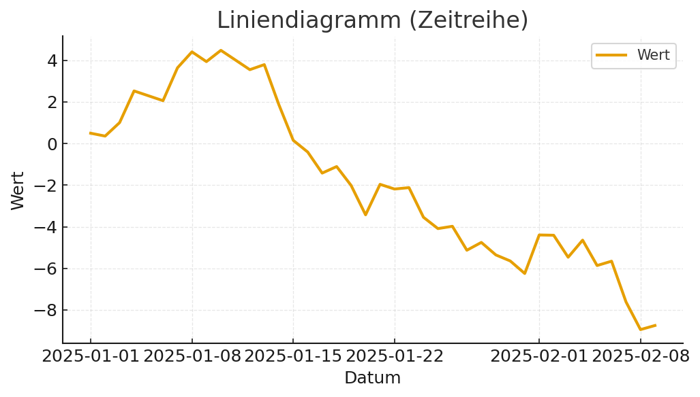
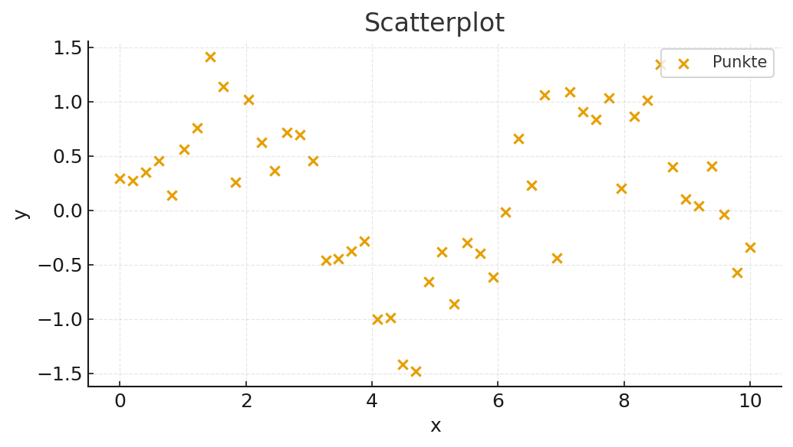
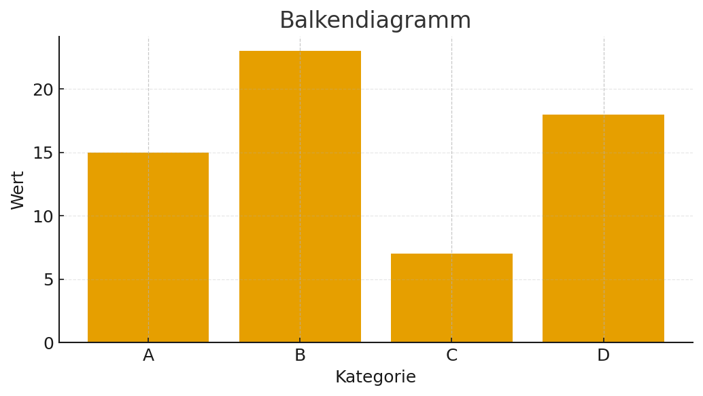
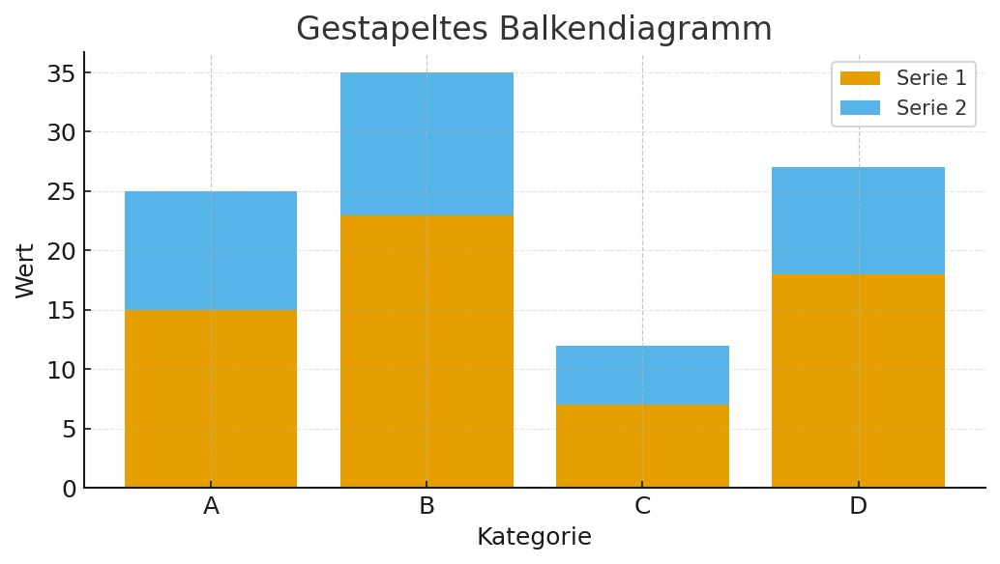
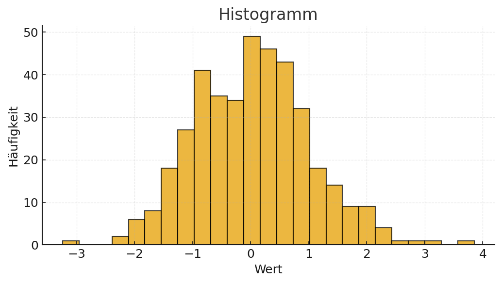
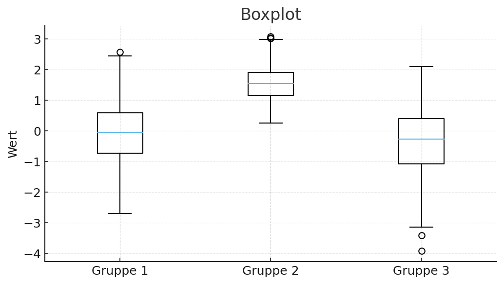
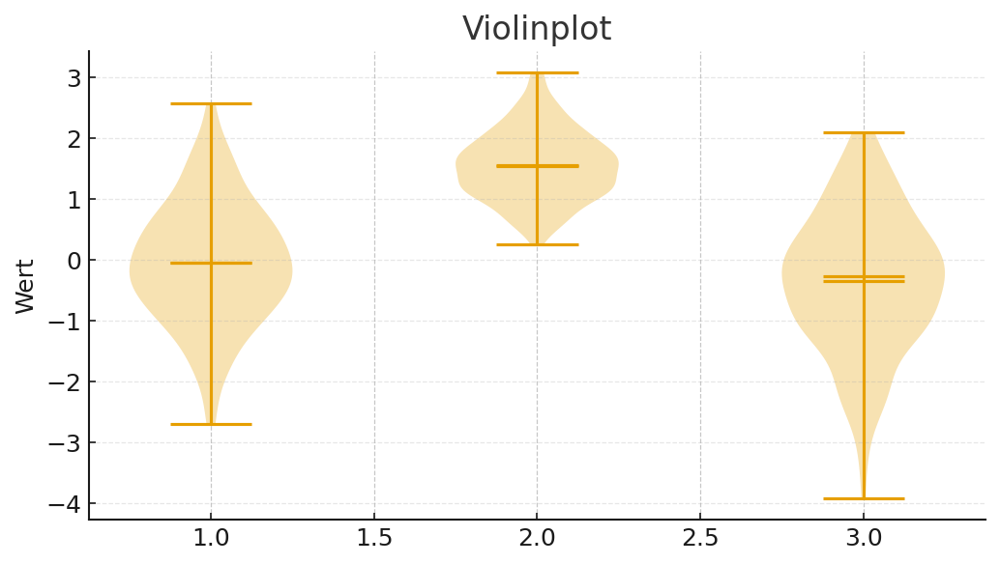
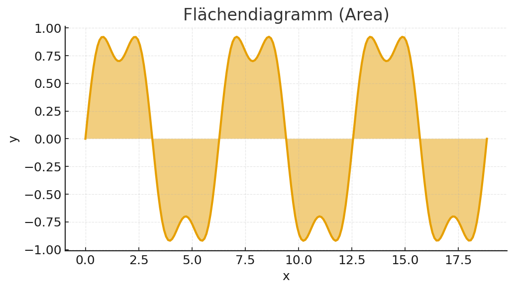
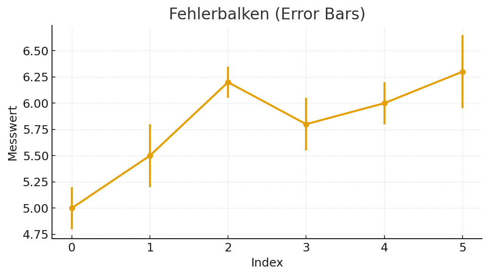
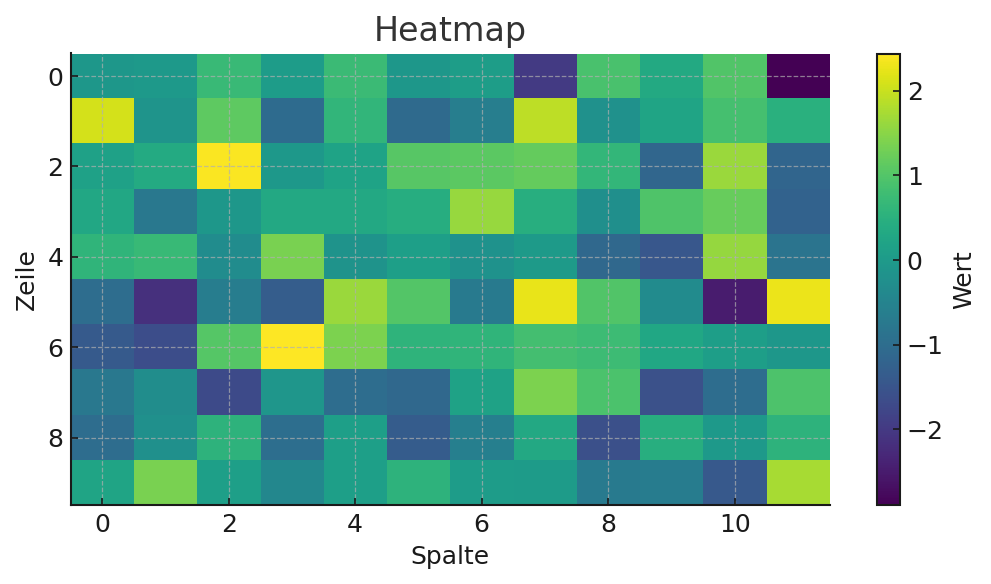

<ul style="list-style-type:circle;">
  <li>REFR - Prof. Franz Reichel</li>
  <li>DSAI - Data Science and Artificial Intelligence - 4XHIF</li>
</ul>

---
# 📈 Diagramm-Galerie mit Matplotlib – Ausführliche Beschreibungen & Einsatzgebiete

Dieses Dokument gibt dir einen **umfassenden Überblick** über die gängigsten Diagrammtypen in Matplotlib, 
inklusive **ausführlicher Beschreibungen** ihrer Anwendungsbereiche und einem **kurzen Codebeispiel**.
Zu jedem Typ findest du Hinweise, wann und warum er sinnvoll ist.

> Jede Grafik wird in einer eigenen Figure erstellt und nutzt keine speziellen Farbschemata.

---

## 🔹 Import & Basis-Setup
```python
import matplotlib.pyplot as plt
```


---

## 1) Liniendiagramm (Zeitreihe)
**Einsatzmöglichkeiten:**  
- Darstellung von **Trends über die Zeit** (z. B. Aktienkurse, Umsatzentwicklung, Temperaturverläufe).  
- Vergleich mehrerer Zeitreihen (z. B. mehrere Produkte oder Länder).  
- Zeigt saisonale Muster oder Langzeitverläufe klar an.  



```python
import numpy as np, pandas as pd, matplotlib.pyplot as plt
dates = pd.date_range("2025-01-01", periods=40, freq="D")
values = np.cumsum(np.random.randn(40))
plt.figure(figsize=(7,4))
plt.plot(dates, values, linewidth=2, label="Wert")
plt.title("Liniendiagramm (Zeitreihe)")
plt.xlabel("Datum"); plt.ylabel("Wert")
plt.grid(alpha=0.3); plt.legend(); plt.tight_layout(); plt.show()
```

>**Idee:** `plot()` für Linien, `linewidth`, `label`, `title`, `xlabel`, `ylabel`, `legend`, `grid` helfen bei Lesbarkeit.

>**Idee:** Datumsachsen automatisch formatieren; `rotation` verbessert Lesbarkeit.
> plt.xticks(rotation=30)
---

## 2) Scatterplot
**Einsatzmöglichkeiten:**  
- Analyse von **Korrelationen** zwischen zwei Variablen (z. B. Größe vs. Gewicht).  
- Aufdecken von **Ausreißern** oder Clustern in den Daten.  
- Gut für explorative Datenanalyse, z. B. Vorstufe für Regressionsmodelle.  



```python
import numpy as np, matplotlib.pyplot as plt
x = np.linspace(0, 10, 50)
y = np.sin(x) + 0.4*np.random.randn(50)
plt.figure(figsize=(7,4))
plt.scatter(x, y, s=35, label="Punkte")
plt.title("Scatterplot")
plt.xlabel("x"); plt.ylabel("y")
plt.grid(alpha=0.3); plt.legend(); plt.tight_layout(); plt.show()
```

>**Idee:** `scatter()` für Punktwolken, `s` für Punktgröße.

---

## 3) Balkendiagramm
**Einsatzmöglichkeiten:**  
- Vergleich von **kategorischen Daten** (z. B. Umsatz je Produktgruppe, Stimmen pro Partei).  
- Darstellung von **Ranglisten** und Top-N-Analysen.  
- Gut geeignet, wenn Kategorien keine natürliche Reihenfolge besitzen.  




```python
import matplotlib.pyplot as plt
cats = ["A", "B", "C", "D"]; vals = [15, 23, 7, 18]
plt.figure(figsize=(7,4))
plt.bar(cats, vals)
plt.title("Balkendiagramm")
plt.xlabel("Kategorie"); plt.ylabel("Wert")
plt.grid(axis="y", alpha=0.3); plt.tight_layout(); plt.show()
```

>**Idee:** `bar()` für Kategorien, `grid(axis="y")` für horizontale Hilfslinien.

---

## 4) Gestapeltes Balkendiagramm
**Einsatzmöglichkeiten:**  
- Zeigt, **woraus sich ein Gesamtwert zusammensetzt** (z. B. Umsatz je Region und Produkt).  
- Gut zum Darstellen von **Anteilen pro Unterkategorie** in jeder Hauptkategorie.  
- Verdeutlicht, wie sich Summen über mehrere Gruppen hinweg bilden.  




```python
import matplotlib.pyplot as plt
cats = ["A", "B", "C", "D"]; vals1 = [15, 23, 7, 18]; vals2 = [10, 12, 5, 9]
plt.figure(figsize=(7,4))
plt.bar(cats, vals1, label="Serie 1")
plt.bar(cats, vals2, bottom=vals1, label="Serie 2")
plt.title("Gestapeltes Balkendiagramm")
plt.xlabel("Kategorie"); plt.ylabel("Wert")
plt.legend(); plt.grid(axis="y", alpha=0.3); plt.tight_layout(); plt.show()
```

---

## 5) Histogramm
**Einsatzmöglichkeiten:**  
- Darstellung der **Verteilung einer einzelnen Variablen** (z. B. Altersverteilung).  
- Identifikation von **Schiefe** oder Mehrgipfligkeit.  
- Vergleich der Verteilungen verschiedener Gruppen durch mehrere überlagerte Histogramme.  



```python
import numpy as np, matplotlib.pyplot as plt
data = np.random.randn(400)
plt.figure(figsize=(7,4))
plt.hist(data, bins=25, edgecolor="black", alpha=0.75)
plt.title("Histogramm")
plt.xlabel("Wert"); plt.ylabel("Häufigkeit")
plt.grid(alpha=0.3); plt.tight_layout(); plt.show()
```

>**Idee:** `hist()` um Verteilungen zu sehen; `bins` steuert die Anzahl der Klassen.
>**Anordnung** `bins=np.arange(0.5,7.5,1)` 

---

## 6) Boxplot
**Einsatzmöglichkeiten:**  
- Zeigt **Median, Quartile, Ausreißer** kompakt auf einen Blick.  
- Vergleich von **Verteilungen zwischen Gruppen** (z. B. Testergebnisse verschiedener Klassen).  
- Ideal für statistische Datenanalyse und Qualitätskontrolle.  



```python
import numpy as np, matplotlib.pyplot as plt
g1 = np.random.normal(0, 1, 200)
g2 = np.random.normal(1.5, 0.6, 200)
g3 = np.random.normal(-0.5, 1.2, 200)
plt.figure(figsize=(7,4))
plt.boxplot([g1, g2, g3], labels=["Gruppe 1", "Gruppe 2", "Gruppe 3"])
plt.title("Boxplot")
plt.ylabel("Wert")
plt.grid(axis="y", alpha=0.3); plt.tight_layout(); plt.show()
```

---

## 7) Violinplot
**Einsatzmöglichkeiten:**  
- Kombination aus Boxplot und **Dichte-Plot** – zeigt detailliert die Verteilungsform.  
- Vergleich der Form und Symmetrie zwischen mehreren Gruppen.  
- Hilfreich bei großen Datensätzen, um Verteilungsunterschiede zu erkennen.  



```python
import numpy as np, matplotlib.pyplot as plt
g1 = np.random.normal(0, 1, 200)
g2 = np.random.normal(1.5, 0.6, 200)
g3 = np.random.normal(-0.5, 1.2, 200)
plt.figure(figsize=(7,4))
plt.violinplot([g1, g2, g3], showmeans=True, showmedians=True)
plt.title("Violinplot")
plt.ylabel("Wert")
plt.grid(axis="y", alpha=0.3); plt.tight_layout(); plt.show()
```

---

## 8) Flächendiagramm (Area)
**Einsatzmöglichkeiten:**  
- Darstellung kumulativer Werte oder **Verlauf und Volumen** gleichzeitig.  
- Ideal für **Stacked Area Charts** (mehrere Bereiche übereinander).  
- Gut, um Entwicklungen mit „gefülltem“ Eindruck zu präsentieren.  



```python
import numpy as np, matplotlib.pyplot as plt
x = np.linspace(0, 6*np.pi, 200)
y = np.sin(x) + 0.3*np.sin(3*x)
plt.figure(figsize=(7,4))
plt.fill_between(x, y, alpha=0.5)
plt.plot(x, y, linewidth=2)
plt.title("Flächendiagramm (Area)")
plt.xlabel("x"); plt.ylabel("y")
plt.grid(alpha=0.3); plt.tight_layout(); plt.show()
```

---

## 9) Fehlerbalken (Error Bars)
**Einsatzmöglichkeiten:**  
- Zeigt **Unsicherheiten, Standardabweichungen oder Konfidenzintervalle** an.  
- Wichtig in der **Experimentalforschung** und bei **Messdaten**.  
- Erlaubt es, Mittelwerte mit ihrer Streuung zu präsentieren.  



```python
import numpy as np, matplotlib.pyplot as plt
x = np.arange(6)
y = np.array([5.0, 5.5, 6.2, 5.8, 6.0, 6.3])
err = np.array([0.2, 0.3, 0.15, 0.25, 0.2, 0.35])
plt.figure(figsize=(7,4))
plt.errorbar(x, y, yerr=err, fmt="o-", capsize=4, linewidth=2)
plt.title("Fehlerbalken (Error Bars)")
plt.xlabel("Index"); plt.ylabel("Messwert")
plt.grid(alpha=0.3); plt.tight_layout(); plt.show()
```

> `errorbar()` zeigt Unsicherheit/Varianz.
---

## 10) Heatmap
**Einsatzmöglichkeiten:**  
- Darstellung von **Korrelationstabellen** oder **2D-Datenfeldern**.  
- Analyse von **Intensitäten und Dichte** über eine Fläche (z. B. Wärmebilder, Sensordaten).  
- Eignet sich, um Muster in großen Tabellen schnell zu erkennen.  



```python
import numpy as np, matplotlib.pyplot as plt
mat = np.random.randn(10, 12)
plt.figure(figsize=(7,4))
plt.imshow(mat, aspect="auto")
plt.title("Heatmap")
plt.xlabel("Spalte"); plt.ylabel("Zeile")
plt.colorbar(label="Wert")
plt.tight_layout(); plt.show()
```

---

## 🔹 Annotations (Pfeile & Text)
```python
x = [0, 1, 2, 3, 4]
y = [0, 1, 4, 9, 16]

plt.figure(figsize=(6,4))
plt.plot(x, y, linewidth=2)
plt.annotate("Scheitelpunkt", xy=(0,0), xytext=(1,5),
             arrowprops=dict(arrowstyle="->"))
plt.title("Annotation-Beispiel")
plt.xlabel("x"); plt.ylabel("y")
plt.grid(alpha=0.3)
plt.show()
```

>**Idee:** `annotate()` für Markierungen im Plot.

---

## 🔹 Achsenlimits, Ticks & Speichern
```python
plt.figure(figsize=(6,4))
plt.plot([0,1,2],[0,1,4])
plt.xlim(-0.5, 2.5)       # x-Achse begrenzen
plt.ylim(-1, 5)           # y-Achse begrenzen
plt.xticks([0,1,2])       # Tick-Positionen
plt.yticks([0,2,4])
plt.title("Achsen & Ticks")
plt.grid(alpha=0.3)
plt.savefig("plot.png", dpi=150, bbox_inches="tight")  # Bild speichern
plt.show()
```

>**Idee:** `savefig()` speichert Grafiken (PNG, SVG, PDF).

---

## ✅ Tipps
- Eine **Figur pro Diagramm** (vermeide verschachtelte Subplots).
- Achsen & Titel immer **beschriften**.
- `tight_layout()` hilft gegen abgeschnittene Labels.
