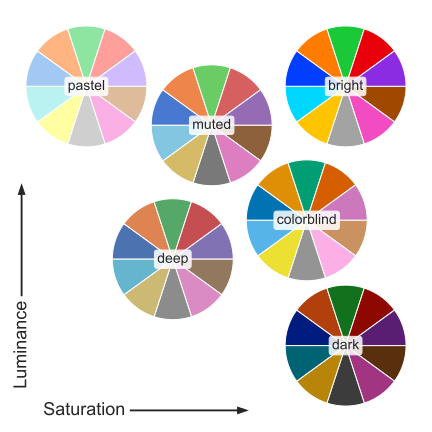
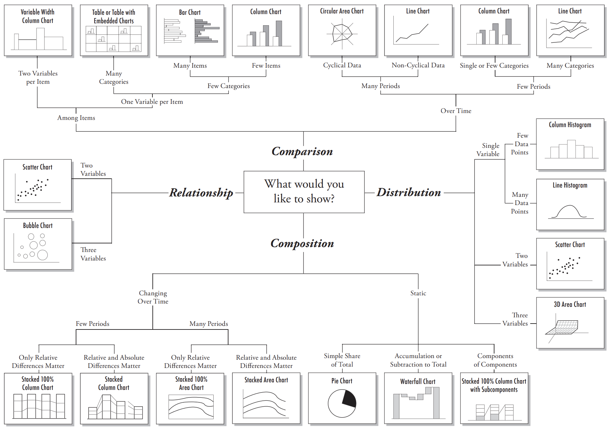
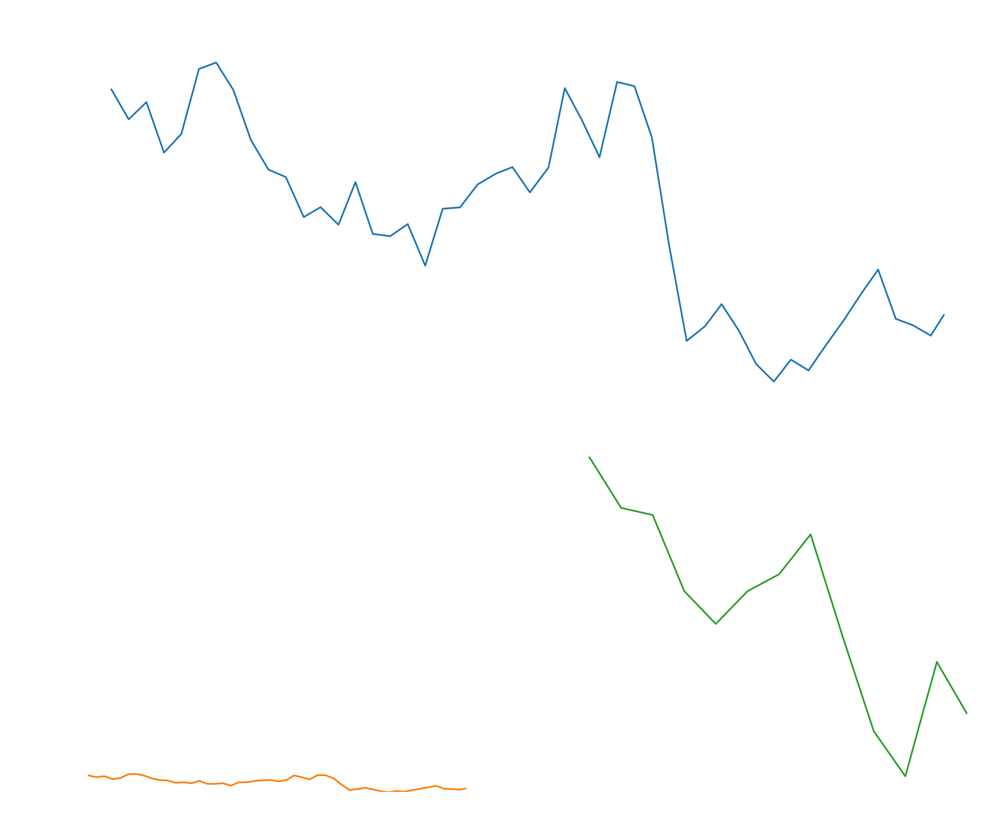

<ul style="list-style-type:circle;">
  <li>REFR - Prof. Franz Reichel</li>
  <li>DSAI - Data Science and Artificial Intelligence - 4XHIF</li>
</ul>

---

# 📊 Datenvisualisierung – Grundlagen und Best Practices

## 🧠 1. Ziele der Datenvisualisierung

### 🗣️ Kommunikation  
Visualisierungen machen komplexe Daten **verständlich und zugänglich**. Sie helfen, Informationen effizient zu vermitteln – oft über Sprach- und Fachgrenzen hinweg.

### 🎤 Präsentation  
Daten sollen **überzeugend dargestellt** werden – etwa in Berichten, Präsentationen oder Dashboards. Der Fokus liegt hier auf einer klaren, ansprechenden und professionellen Darstellung.

### 🔍 Interpretation  
Durch Visualisierung lassen sich **Muster, Trends und Zusammenhänge erkennen**, die in Rohdaten schwer zu sehen wären. Sie ist somit ein Werkzeug zur **Datenanalyse und Hypothesenbildung**.

### 📖 Storytelling *(und Manipulation?)*  
Visuelle Darstellungen können eine **Geschichte erzählen**, um den Betrachter zu führen und Emotionen zu wecken.  
> 💡 Hinweis: Storytelling kann auch **manipulativ** eingesetzt werden – etwa durch verzerrte Skalen, selektive Datenauswahl oder suggestive Farben. Deshalb ist **Transparenz und Ethik** in der Datenvisualisierung entscheidend.

### 📊 Monitoring  
In Dashboards oder Echtzeitsystemen dient Visualisierung der **Überwachung von Kennzahlen (KPIs - Key Performance Indicator)**.  
Sie ermöglicht es, **Abweichungen oder Anomalien frühzeitig zu erkennen** und entsprechend zu handeln.

### 🎮 Unterhaltung  
Daten können auch **spielerisch oder ästhetisch ansprechend** präsentiert werden – etwa in interaktiven Visualisierungen, Kunstprojekten oder datenbasierten Geschichten.
> 💡https://www.productchart.com/laptops/
---

## 📋 2. Grundprinzipien guter Visualisierung
- **Klarheit:** Jede Grafik sollte eine zentrale Aussage transportieren.  
- **Einfachheit:** Vermeide unnötige visuelle Elemente („Chartjunk“).  
- **Konsistenz:** Gleiche Skalen, Farben und Formate bei mehreren Diagrammen.  
- **Genauigkeit:** Daten dürfen nicht durch falsche Achsen oder Skalen verzerrt werden.  
- **Lesbarkeit:** Beschriftungen, Legenden und Achsen müssen gut lesbar sein.  

---

## 🎨 3. Gestaltungselemente
- **Farben:**  
  - Wenige, kontrastreiche Farben verwenden.  
  - Gleiche Kategorien → gleiche Farben.  
  - Farbblinde-freundliche Paletten berücksichtigen.  
- **Formen & Größen:** Zur Betonung von Unterschieden geeignet, aber sparsam einsetzen.  
- **Layout & Komposition:** Weißraum sinnvoll nutzen, um Klarheit zu schaffen.  

---

## 📈 4. Arten von Visualisierungen

[//]: # (![chart_what_would_you_liek_to_show.png]&#40;resources/chart_what_would_you_liek_to_show.png&#41;)

---

## 🚫 5. Häufige Fehler
- Falsche oder abgeschnittene Achsen.  
- Zu viele Farben oder 3D-Effekte.  
- Fehlende Beschriftungen oder Legenden.  
- Überfrachtete Visualisierungen ohne klare Aussage.  

---

## 🎭 6. Daten-Manipulation und Akzentuierung

Visualisierungen sollen informieren – doch sie können auch **manipulieren oder überakzentuieren**.  
Bereits kleine Änderungen in Achsen, Skalierungen oder Hervorhebungen verändern die Wahrnehmung drastisch.

### Häufige Techniken der Akzentuierung

| Technik | Beschreibung | Wirkung |
|----------|---------------|---------|
| **Achsenskalierung** | Verkürzen oder Strecken der Y-Achse | Schwankungen wirken dramatischer oder stabiler |
| **Zeitachse stauchen** | Weniger Datenpunkte oder kleinerer Zeitbereich | Veränderungen wirken schneller und hektischer |
| **Zoom / Ausschnittwahl** | Nur Teilbereich der Daten zeigen | Unliebsame Trends werden ausgeblendet |
| **Farbliche Akzentuierung** | Bestimmte Bereiche oder Linien werden kräftiger gefärbt | Lenkt den Blick gezielt auf gewünschte Elemente |
| **Nicht-Null-Achsenstart** | Y-Achse beginnt nicht bei 0 | Kleine Unterschiede wirken groß |
| **Verhältnis vs. absolute Werte** | Prozentdarstellung statt Mengen (oder umgekehrt) | Perspektive wird gezielt verändert |

### Beispiel

**Manipulation durch Achsenskalierung – Bitcoin-Kurs**

- Oben: realer Kursverlauf  
- Unten links: vertikal gestreckt (wirkt volatiler)  
- Unten rechts: horizontal gestaucht (wirkt hektischer)

[//]: # ()

### Fazit

> Schon minimale visuelle Eingriffe können aus neutraler Information eine **emotionale Botschaft** machen.  
> Verantwortungsvolle Datenvisualisierung verlangt daher Transparenz über Maßstäbe, Ausschnitte und Designentscheidungen.

## ✅ 6. Best Practices
- Erzähle eine **Daten-Story**: Führe den Betrachter durch die Erkenntnisse.  
- Verwende **Annotationen** und **Highlights**, um Wichtiges hervorzuheben.  
- Teste deine Visualisierung mit anderen Personen auf Verständlichkeit.  
- Achte auf **Barrierefreiheit** und **Responsivität** bei digitalen Charts.  

---
