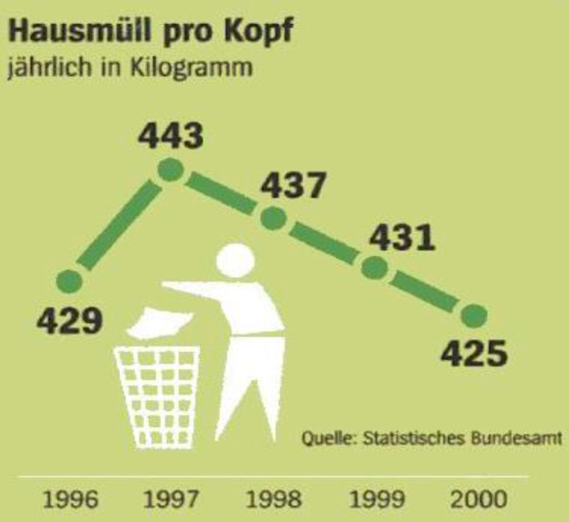
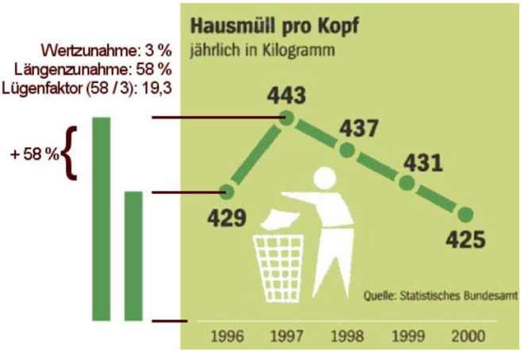
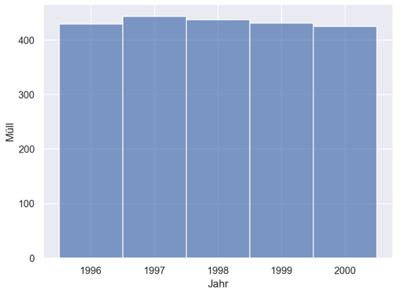
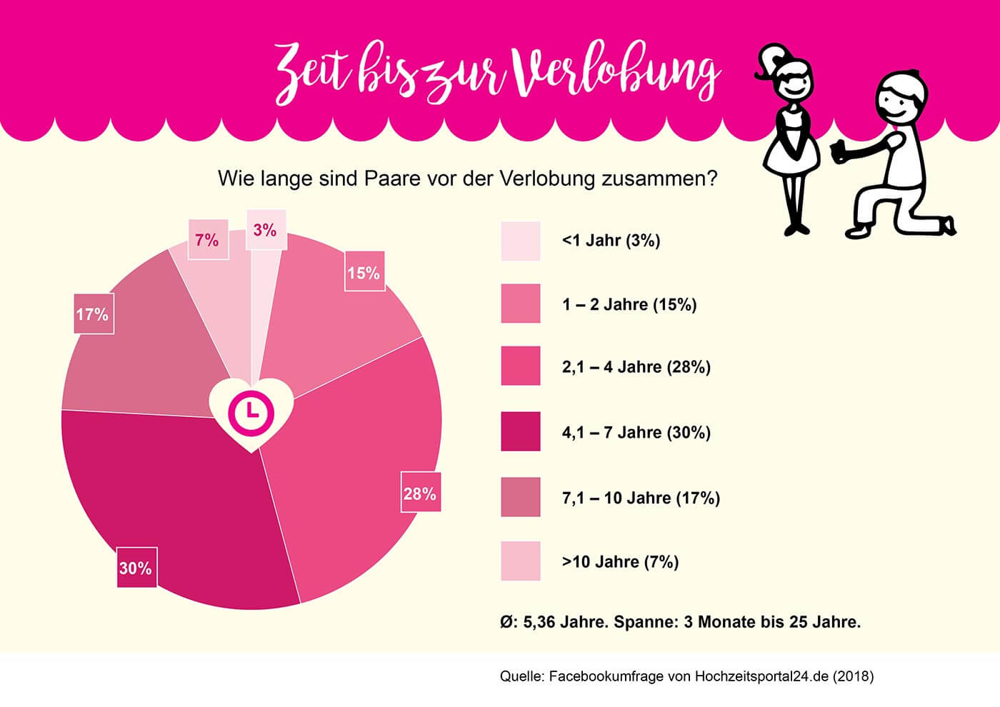
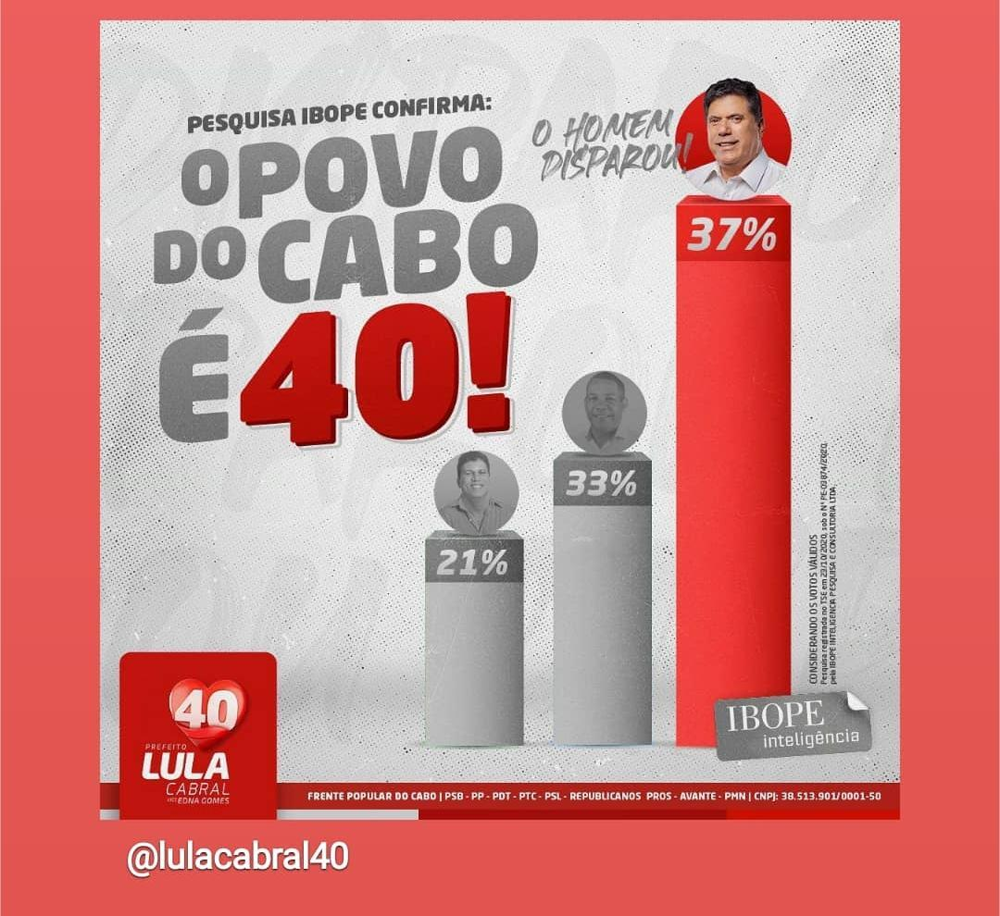
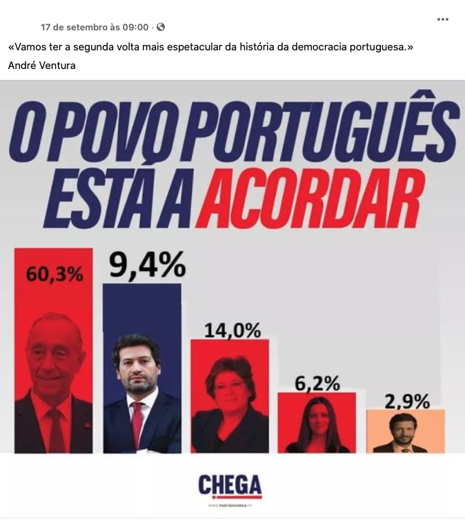
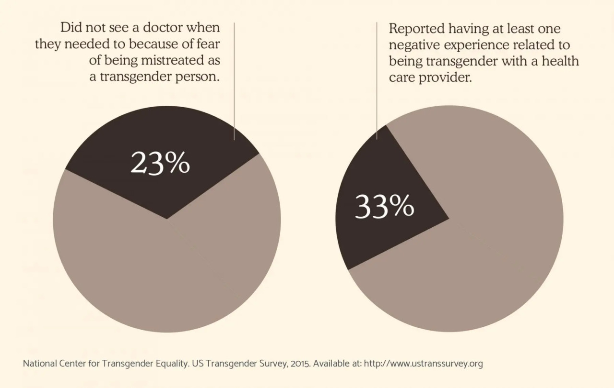
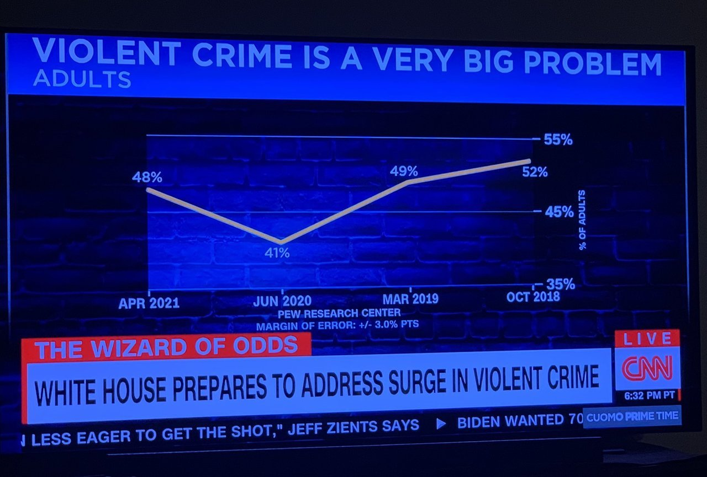
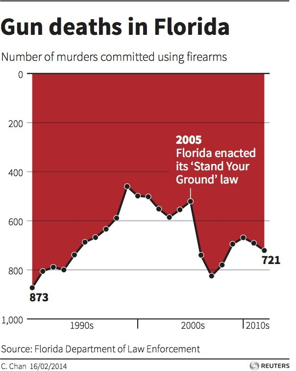

<ul style="list-style-type:circle;">
  <li>REFR - Prof. Franz Reichel</li>
  <li>DSAI - Data Science and Artificial Intelligence - 4XHIF</li>
</ul>

---

# 👹 Visualisation Manipulation Examples

## Bild 1

  

  

## Bild 2 Farbe und numerische Daten

> 💡Farbintensität sollte mit Messgröße korrelieren

## Bild 3 Skalierung

## Bild 4

## Bild 5

## Bild 6

## Bild 7

> 🔍 Es handelt sich um eine in vielen US-Bundesstaaten geltende Regelung, die das Recht auf Notwehr erweitert, indem sie es Personen erlaubt, im Falle einer Bedrohung tödliche Gewalt anzuwenden, ohne dass sie sich vorher aus einer bedrohlichen Situation zurückziehen müssen.

## Chat GPT Analyse zu Bild 3
## 😈 Beispiel: Manipulative Datenvisualisierung in der politischen Kommunikation

Ein klassisches Beispiel für **visuelle Manipulation** zeigt die Kampagnengrafik Bild 3:

### 🎨 Analyse der Gestaltung

Das Bild zeigt eine politische Umfrage, dargestellt als **Balkendiagramm mit Porträts** und starkem **emotionalem Design**.  
Die Absicht ist klar: Überlegenheit und Dynamik einer bestimmten Person oder Partei zu vermitteln.

---

### 🔍 Auffällige Gestaltungselemente

| Merkmal | Beschreibung | Wirkung |
|:---------|:--------------|:--------|
| **Farbwahl** | Dominantes **Rot** für den Siegerbalken, **Grau** für die anderen | Rot wirkt energisch, aktiv, siegreich – Grau dagegen passiv |
| **Größenverhältnis** | Der Balken mit 37 % ist visuell **überproportional höher** als der mit 33 % | Übertreibt den Vorsprung deutlich |
| **Textgestaltung** | Großbuchstaben, Ausrufezeichen („O POVO DO CABO É 40!“) | Emotional, ruft Zugehörigkeit und Begeisterung hervor |
| **Bildplatzierung** | Der „führende Kandidat“ steht auf der höchsten Säule | Erhöht die gefühlte Autorität |
| **Wortwahl im Zusatztext** | „O homem disparou“ – „Der Mann hat sich abgesetzt“ | Sprachliche Verstärkung der visuellen Botschaft |

---

### 🧩 Interpretation

Die Grafik nutzt gezielt **visuelle Verzerrung**, **Farbpsychologie** und **sprachliche Überhöhung**, um  
eine kleine numerische Differenz (37 % vs. 33 %) als überwältigenden Sieg darzustellen.  

Dies ist ein Paradebeispiel für **visuelle Datenmanipulation**:
> Zahlen bleiben korrekt, aber ihre Darstellung verändert massiv die Wahrnehmung.

---

### 🧠 Fazit

Diese Art der Gestaltung zeigt, wie durch
- **Skalierung**,  
- **Farbwahl**,  
- **emotionale Typografie**  
und **fehlenden Kontext**  
eine eigentlich geringe Differenz **dramatisch überhöht** werden kann.

> **Merke:** Objektive Daten sind keine Garantie für objektive Kommunikation.  
> Der visuelle Rahmen entscheidet, *wie* Daten wahrgenommen werden.

## Quelle:
> Bilder von SCRE auch zu finden unter: https://ifnode.htlstp.ac.at/visualization.md#/