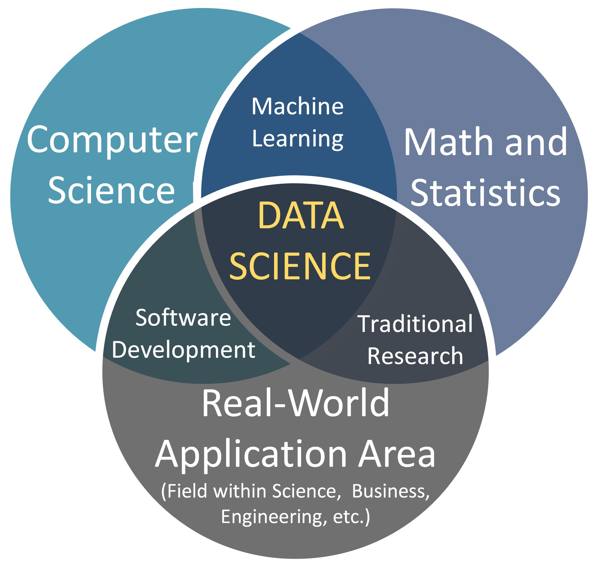
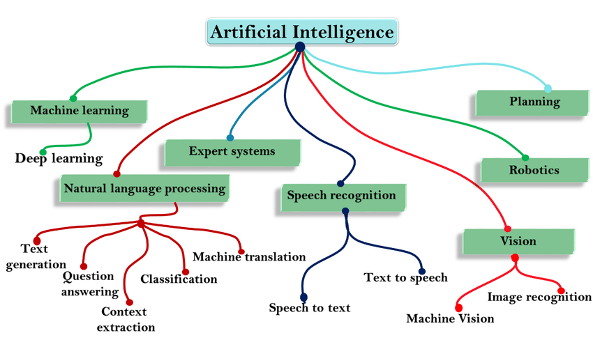
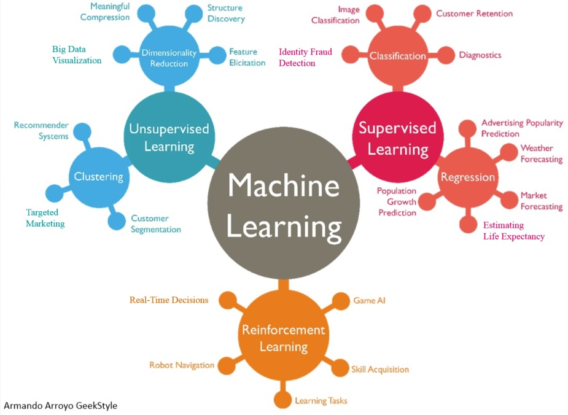

<ul style="list-style-type:circle;">
  <li>REFR - Prof. Franz Reichel</li>
  <li>DSAI - Data Science and Artificial Intelligence - 4XHIF</li>
</ul>

---

# 🧠 Artificial Intelligence, Machine Learning & Data Science

## 1. 📊 Was ist Data Science und aus welchen Gebieten setzt sie sich zusammen?

**Data Science** ist ein interdisziplinäres Feld, das sich mit dem **Gewinnen von Erkenntnissen aus Daten** beschäftigt. Ziel ist es, Muster zu erkennen, Vorhersagen zu treffen und datenbasierte Entscheidungen zu unterstützen.

### 🔧 Zentrale Bestandteile von Data Science

Data Science kombiniert Methoden aus mehreren Fachgebieten:

1. **Mathematik & Statistik**
   - Wahrscheinlichkeitsrechnung  
   - Regression  
   - statistische Tests  

2. **Informatik & Softwareentwicklung**
   - Algorithmen  
   - Datenbanken  
   - Programmierung (Python, R, SQL)

3. **Machine Learning**
   - Klassifikation  
   - Clustering  
   - neuronale Netze  

4. **Domänenwissen**
   - Verständnis des Anwendungsgebiets (z. B. Medizin, Finanzen)

5. **Datenaufbereitung & Engineering**
   - Datenbereinigung, ETL 
   > ETL – kurz für „Extract, Transform, Load“
   - Big-Data-Technologien (Hadoop, Spark)

6. **Datenvisualisierung**
   - Dashboards  
   - Diagrammerstellung  

---

## 2. 🤖 Was ist AI (Artificial Intelligence)?

**Artificial Intelligence (AI)** ist ein Bereich der Informatik, der Systeme entwickelt, die **Aufgaben lösen können, die normalerweise menschliche Intelligenz erfordern**.

### 🧱 Grundlegende Schritte / Bausteine der KI

1. **Wahrnehmung (Perception)** – Verarbeitung von Sensordaten
2. **Wissensrepräsentation (Knowledge Representation)** – Logik, Ontologien
   > Ontologien sind
formale Wissensmodelle, die Konzepte und Beziehungen in einem bestimmten Bereich definieren, um ein gemeinsames Verständnis zu schaffen
3. **Schlussfolgern & Problemlösen (Reasoning & Problem Solving)** – deduktive / heuristische Methoden
4. **Lernen (Machine Learning / Learning)** – Mustererkennung
5. **Planung & Handeln (Planning & Acting)** – Zielfindung, Entscheidungsfindung
6. **Interaktion (Interaction / Natural Language Interaction)** – natürliche Sprache, Dialogsysteme

---

## 3. 🧩 Subfields der AI

### Machine Learning (ML)

Machine Learning (ML) ist ein Teilgebiet der KI, bei dem Systeme aus Daten lernen, Muster erkennen und Vorhersagen treffen.
Lernen aus Daten ohne explizite Programmierung.
Arten:
- Supervised Learning  
- Unsupervised Learning  
- Reinforcement Learning  

- Deep Learning
   Einsatz:
  - Bildverarbeitung  
  - Sprachmodelle  
  - Generative KI  

---

### Natural Language Processing (NLP)
NLP ermöglicht es Maschinen, menschliche Sprache zu verstehen, zu verarbeiten und zu erzeugen.
- Text Generation
Automatische Erstellung von Texten basierend auf Mustern in Trainingsdaten.  
**Beispiele:** ChatGPT, automatische Zusammenfassungen.

- Question Answering
Systeme beantworten Fragen basierend auf Wissen aus Datenbanken oder Modellen.  
**Beispiele:** Suchmaschinen, Chatbots.

- Context Extraction
Extrahiert semantische Informationen wie Entitäten, Beziehungen oder Konzepte aus Texten.  
**Beispiele:** Named Entity Recognition, Topic Extraction.

- Classification
Einordnung von Texten in Kategorien.  
**Beispiele:** Spamfilter, Sentimentanalyse.

- Machine Translation
Übersetzung zwischen Sprachen durch statistische oder neuronale Modelle.  
**Beispiele:** DeepL, Google Translate.

---

### Expertensysteme
Expertensysteme sind regelbasierte Systeme, die das Wissen menschlicher Experten nachbilden.
Regelbasierte Problemlöser, populär in den 80ern.
#### Typische Eigenschaften
- Wissensbasis (Regelsystem)
- Inferenzmaschine (zieht Schlussfolgerungen)
- Erklärbarkeit der Entscheidungen

Beispiele
  - medizinische Diagnosesysteme  
  - Fehlerdiagnose in technischen Systemen  

---

### Speech Recognition
Ermöglicht Maschinen, gesprochene Sprache zu verstehen oder zu erzeugen.

- Speech to Text (STT)
   - Wandelt gesprochene Worte in schriftlichen Text um.  
   **Beispiele:** Diktierfunktionen, Transkriptionstools.
- Text to Speech (TTS)
  - Erzeugt synthetische Sprache aus Texten.  
  **Beispiele:** Sprachassistenten wie Siri, Alexa, Google Assistant.

Typische Anwendungen
- Telefonroboter  
- Assistive Technologien  
- Navigation in Fahrzeugen  

---

### Computer Vision
Computer Vision umfasst Methoden zur Verarbeitung visueller Daten wie Bilder oder Videos.
Verstehen von Bildern/Videos:
- Image Recognition

   **Beispiele:** Gesichtserkennung, Produkterkennung, Qualitätssicherung.

- Machine Vision

  Industrieorientierte Bildverarbeitung zur Qualitätskontrolle, Vermessung oder Automatisierung.  
  **Beispiele:** Robotersteuerung, Fertigungsanalyse.

---

### Robotics
Die Robotik verbindet KI mit Mechanik, Sensorik und Aktorik, um autonome oder halbautonome Systeme zu bauen.
#### Komponenten
- Sensoren (Kameras, Lidar, Temperatur, Druck)
- Aktoren (Motoren, Greifarme)
- Steuerungsalgorithmen
- Planungs- und Wahrnehmungsmodelle

#### Beispielanwendungen
- autonome Drohnen  
- Industrieroboter  
- Serviceroboter (z. B. in Pflege oder Gastronomie)  
---

### Planning
Planungssysteme ermöglichen Maschinen, Ziele zu definieren und optimale Handlungssequenzen zu erstellen.
#### Typische Aufgaben
- Pfadplanung  
- Ressourcenallokation  
- Entscheidungsbäume  
- Optimierungsprobleme  

#### Einsatzgebiete
- Robotik  
- Logistik  
- autonome Systeme  

---

## 4. ⏳ Geschichte der Artificial Intelligence – Wichtige Meilensteine

| Jahr | Meilenstein |
|------|-------------|
| **1943** | Künstliche Neuronen (McCulloch & Pitts) |
| **1950** | Turing-Test (Alan Turing) |
| **1956** | Dartmouth-Konferenz – offizielle Geburtsstunde der KI |
| **1966–1974** | Erste KI-Programme (ELIZA, SHRDLU) |
| **1974–1980** | 1. KI-Winter |
| **1980er** | Expertensysteme |
| **1987–1993** | 2. KI-Winter |
| **1997** | IBM Deep Blue schlägt Garry Kasparov |
| **2006** | Durchbruch Deep Learning |
| **2012** | ImageNet-Revolution |
| **2016** | AlphaGo besiegt Lee Sedol |
| **2020+** | Aufstieg großer Sprachmodelle |

### ⭐ Deep Thought aus dem Buch: *Hitchhiker’s Guide to the Galaxy*

Der legendäre Supercomputer **Deep Thought** wurde beauftragt, die Antwort auf die Frage nach dem Leben, dem Universum und dem ganzen Rest zu finden.  
Nach **7,5 Millionen Jahren Rechenzeit** war die Antwort:

> **„42“**

---

## 5. 🧬 Machine Learning vs. Deep Learning

### **Machine Learning**
- benötigt oft manuell definierte Features  
- funktioniert gut mit kleineren Datensätzen  
- Beispiele: Entscheidungsbäume, SVM  

### **Deep Learning**
- lernt Features automatisch  
- benötigt große Datenmengen  
- basiert auf tiefen neuronalen Netzen  

---

## 6. 🧬 Welche AI gibt es schon? – Schwache vs. starke KI

### 🤏 Schwache KI (Narrow AI)
Aktueller Stand der Technik.  
Spezialisiert auf **eine** Aufgabe.

Beispiele:
- Sprachmodelle  
- Suchmaschinen  
- Bilderkennung  
- Empfehlungssysteme  
- autonome Fahrzeuge  

### 💪 Starke KI (AGI – Artificial General Intelligence)
Hypothetische KI, die:
- wie ein Mensch denken kann  
- flexibel Probleme löst  
- Bewusstsein besitzen könnte  

**Existiert heute nicht.**

Fiktive Beispiele:
- Deep Thought  
- HAL 9000  
- Skynet  
- Data (Star Trek)

---

## 📘 Zusammenfassung

- **Data Science** = Statistik + Informatik + ML + Domänenwissen  
- **AI** = Maschinen Intelligenz verleihen  
- **Subfields** = ML, Deep Learning, NLP, Vision, Robotics …  
- **Meilensteine** = Turing → Deep Learning → heutige KI-Systeme  
- **Schwache KI** existiert heute, **starke KI** ist Zukunftsmusik  

> Deep Thought würde vermutlich sagen:  
> *„Vergesst nicht, die richtige Frage zu stellen.“*
