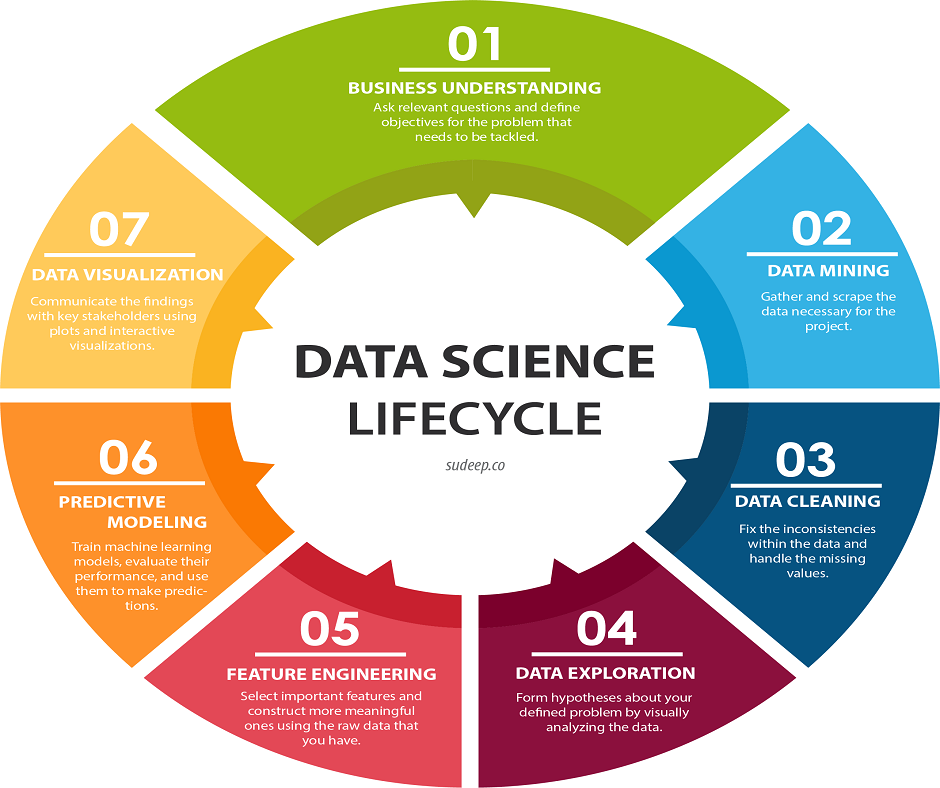
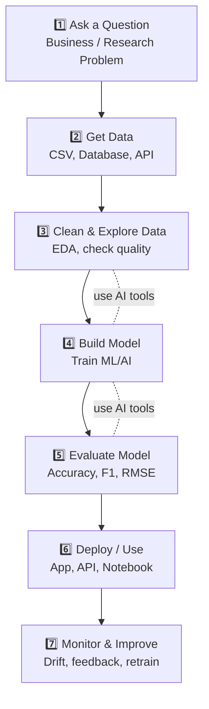

<ul style="list-style-type:circle;">
  <li>REFR - Prof. Franz Reichel</li>
  <li>DSAI - Data Science and Artificial Intelligence - 4XHIF</li>
</ul>

---

# Data Science Lifecycle – Ausführliche Ausarbeitung

Der Data Science Lifecycle beschreibt den kompletten Prozess, wie ein datengetriebenes Projekt entsteht – von der Problemdefinition bis zur Kommunikation der Ergebnisse.  
Dieses Dokument erläutert alle sieben Schritte des Lifecycles im Detail.

---

## 1. Business Understanding (Geschäftsverständnis)

Im ersten Schritt wird das Problem klar definiert und im Kontext des Unternehmens oder Projekts verstanden.

### Ziele
- Relevante Fragen formulieren  
- Geschäftliche Ziele und KPIs definieren  
- Stakeholder identifizieren  
- Umfang und Grenzen des Projekts festlegen  

### Bedeutung
Ein präzises Verständnis verhindert Fehlentwicklungen und stellt sicher, dass die Analyse echten Mehrwert schafft.

---

## 2. Data Mining (Datensammlung)

In dieser Phase werden alle relevanten Daten beschafft und zusammengeführt.

### Aufgaben
- Datenquellen identifizieren (Datenbanken, APIs, Sensoren, Logs, Web)  
- Daten sammeln und extrahieren  
- Datenformate vereinheitlichen  
- Rohdaten auf Vollständigkeit prüfen  

### Typische Tools & Technologien
- SQL  
- Python (Pandas, Requests, Scraping-Tools)  
- Hadoop, Spark  
- Automatisierte ETL-Pipelines  

---

## 3. Data Cleaning (Datenbereinigung)

Die Qualität der Modelle hängt direkt von der Qualität der Daten ab.  
Data Cleaning ist daher einer der arbeitsintensivsten und wichtigsten Schritte.

### Aufgaben
- Fehlende Werte behandeln (Imputation, Entfernen, Ersetzen)  
- Duplikate entfernen  
- Ausreißer erkennen und korrigieren  
- Datentypen harmonisieren (z. B. Datumsformate)  
- Daten normalisieren oder skalieren  
- Inkonsistenzen beheben  

### Ziel
Saubere, konsistente Daten, die für Analyse und Modellierung geeignet sind.

---

## 4. Data Exploration (Datenexploration)

Die explorative Datenanalyse (EDA) dient dazu, ein tiefes Verständnis der Daten zu erlangen.

### Methoden
- Statistische Kennzahlen (Mittelwert, Median, Varianz)  
- Visualisierungen (Histogramme, Boxplots, Scatterplots, Heatmaps)  
- Korrelationen erkennen  
- Hypothesen bilden  
- Muster, Trends und Auffälligkeiten entdecken  

### Nutzen
Die EDA liefert wertvolle Erkenntnisse, die später das Feature Engineering und die Modellwahl beeinflussen.

---

## 5. Feature Engineering

Feature Engineering bedeutet, die Daten so aufzubereiten, dass Machine-Learning-Modelle möglichst gute Ergebnisse liefern.

### Aufgaben
- Auswahl relevanter Features  
- Konstruktion neuer Features (z. B. Zeitdifferenzen, aggregierte Werte)  
- Kodieren von Kategorien (One-Hot-Encoding, Label-Encoding)  
- Skalieren und Normalisieren  
- Reduktion der Dimensionalität (PCA, Feature Selection)  

### Beispiele
- Aus einem Zeitstempel den Wochentag oder die Stunde extrahieren  
- Text in numerische Merkmale umwandeln (TF-IDF, Embeddings)

---

## 6. Predictive Modeling (Vorhersagemodelle)

Hier werden Machine-Learning-Modelle entwickelt, trainiert, getestet und optimiert.

### Schritte
- Daten in Trainings- und Testsets aufteilen  
- Modell(e) auswählen  
- Hyperparameter optimieren  
- Modelle trainieren und evaluieren  
- Modelle vergleichen und auswählen  

### Typische ML-Modelle
- Lineare Regression  
- Entscheidungsbäume & Random Forest  
- Gradient Boosting (XGBoost, LightGBM)  
- Neuronale Netze  
- Support Vector Machines  

### Wichtige Metriken
- Accuracy, Precision, Recall, F1  
- RMSE, MAE  
- ROC-AUC  
- Confusion Matrix  

---

## 7. Data Visualization (Datenvisualisierung)

Im letzten Schritt werden die Ergebnisse so aufbereitet, dass sie verständlich kommuniziert werden können.

---

### Aufgaben
- Erstellung von Diagrammen, Grafiken und Dashboards  
- Darstellung der wichtigsten Erkenntnisse  
- Visualisierung von Modellleistungen  
- Erstellung von Berichten für Stakeholder  
- Ableitung von Handlungsempfehlungen  

### Tools
- Matplotlib, Seaborn, Plotly  
- Power BI, Tableau  
- Dash, Streamlit  

### Ziel
Die Ergebnisse müssen klar, verständlich und entscheidungsrelevant präsentiert werden.

---

# Zusammenfassung

Der Data Science Lifecycle besteht aus sieben eng verknüpften Schritten:

1. **Business Understanding**  
2. **Data Mining**  
3. **Data Cleaning**  
4. **Data Exploration**  
5. **Feature Engineering**  
6. **Predictive Modeling**  
7. **Data Visualization**

Der Prozess ist iterativ – Erkenntnisse in einem Schritt können zu früheren Schritten zurückführen (z. B. erneutes Feature Engineering oder zusätzliche Datensammlung).

---
# Workflow

---
# Hinweis
Dieser Lifecycle stellt einen bewährten Standard dar, wird aber je nach Unternehmen oder Anwendungsfall erweitert – z. B. mit MLOps, Deployment, Monitoring oder Feedback-Loops.

