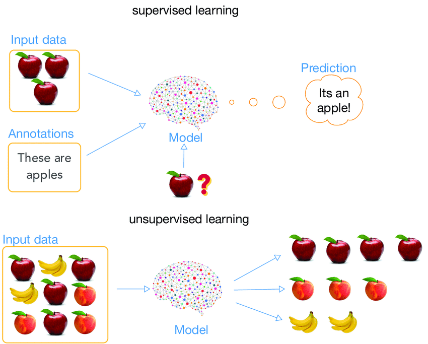

<ul style="list-style-type:circle;">
  <li>REFR - Prof. Franz Reichel</li>
  <li>DSAI - Data Science and Artificial Intelligence - 4XHIF</li>
</ul>

---

# Machine Learning Paradigmen

Machine Learning lässt sich in drei grundlegende Lernparadigmen einteilen:  
**Supervised Learning**, **Unsupervised Learning** und **Reinforcement Learning**.  
Diese unterscheiden sich darin, wie ein Modell trainiert wird und welche Art von Daten es benötigt.

---

## 1. Supervised Learning (Überwachtes Lernen)

Beim überwachten Lernen wird ein Modell mit **gelabelten Daten** trainiert.  
Das bedeutet: Für jedes Beispiel in den Trainingsdaten liegt **eine richtige Antwort (Label)** vor.

### Funktionsweise
- Eingaben (Features) → Modell → Ausgabe (Vorhersage)  
- Modell wird durch Vergleich mit dem Label korrigiert (Loss-Funktion + Optimierung)

### Typische Aufgaben
- **Klassifikation**  
  - Kategorien vorhersagen (z. B. Spam / Nicht-Spam)
- **Regression**  
  - Kontinuierliche Werte vorhersagen (z. B. Preis, Temperatur)

### Beispiele
- E-Mail-Spamfilter  
- Kreditrisiko-Bewertung  
- Bilderkennung (Hund vs. Katze)  
- Vorhersage von Immobilienpreisen  

### Algorithmen (Beispiele)
- Lineare Regression, Logistische Regression  
- Decision Trees, Random Forest  
- Gradient Boosting (XGBoost, LightGBM)  
- Neuronale Netze (CNNs, MLPs)  
- Support Vector Machines  

### Wann benutzt man Supervised Learning?
Bei klar definierten Aufgaben mit bekannten Zielwerten – oft die präziseste ML-Form.

---

## 2. Unsupervised Learning (Unüberwachtes Lernen)

Beim unüberwachten Lernen liegen **keine Labels** vor.  
Das Modell versucht, **Strukturen, Muster oder Gruppen** in den Daten selbstständig zu erkennen.

### Funktionsweise
- Nur Eingabedaten → Modell  
- Kein "richtig oder falsch" – das Modell entdeckt Eigenheiten der Daten

### Typische Aufgaben
- **Clustering**: Ähnliche Datenpunkte gruppieren  
- **Dimensionalitätsreduktion**: Reduzieren komplexer Datensätze  
- **Anomalieerkennung**: Ungewöhnliche Muster finden  
- **Dichteschätzung**  

### Beispiele
- Kundensegmentierung im Marketing  
- Gruppierung ähnlicher Produkte  
- Erkennen von Betrugsmustern  
- Reduktion von Bilddimensionen (z. B. PCA)

### Algorithmen (Beispiele)
- K-Means Clustering  
- Hierarchisches Clustering  
- DBSCAN  
- PCA, t-SNE, UMAP  
- Autoencoder  

### Wann benutzt man Unsupervised Learning?
Wenn keine Labels vorhanden sind oder man verborgene Muster erkennen möchte.

---

## 3. Reinforcement Learning (Verstärkendes Lernen)

Reinforcement Learning (RL) ist grundlegend anders.  
Ein Agent lernt durch **Interaktion mit einer Umgebung**, indem er Aktionen ausführt und **Belohnungen** erhält.

### Funktionsweise
- Agent → führt Aktion aus  
- Umgebung → gibt *Reward* + neuen Zustand  
- Agent versucht, langfristig maximale Belohnung zu erzielen  

Es ist vergleichbar mit Lernen durch Versuch und Irrtum.

### Typische Aufgaben
- **Strategiefindung**  
- **Steuerungsprobleme**  
- **Optimierung komplexer Abläufe**

### Beispiele
- Gaming (Atari, Schach, Go)  
- Robotik (Navigation, Greifarme)  
- Autonomes Fahren  
- Ressourcenmanagement in Rechenzentren  

### Algorithmen (Beispiele)
- Q-Learning  
- Deep Q-Networks (DQN)  
- Policy Gradient Methoden  
- Actor–Critic (A2C, PPO)  

### Besonderheiten
- Belohnungen können verzögert auftreten  
- Exploration (Neues ausprobieren) vs. Exploitation (Erlerntes nutzen)  
- Lernprozess oft teuer, aber sehr leistungsfähig

### Wann benutzt man Reinforcement Learning?
Wenn Entscheidungen in **Sequenzen** getroffen werden müssen und das Ziel langfristig optimiert werden soll.

---

# Vergleich der drei Paradigmen

| Paradigma | Hat Labels? | Ziel | Typische Aufgaben |
|----------|-------------|------|-------------------|
| **Supervised Learning** | ✅ Ja | Vorhersage einer bekannten Ausgabe | Klassifikation, Regression |
| **Unsupervised Learning** | ❌ Nein | Muster & Strukturen entdecken | Clustering, Dimensionalitätsreduktion |
| **Reinforcement Learning** | ➖ Belohnungen statt Labels | Strategie optimieren | Spiele, Robotik, Steuerung |

---

# Kurz zusammengefasst
- **Supervised:** Lernen mit Beispielantworten → *Vorhersagen treffen*.  
- **Unsupervised:** Lernen ohne Antworten → *Muster erkennen*.  
- **Reinforcement:** Lernen durch Belohnungen → *Handlungen optimieren*.  

