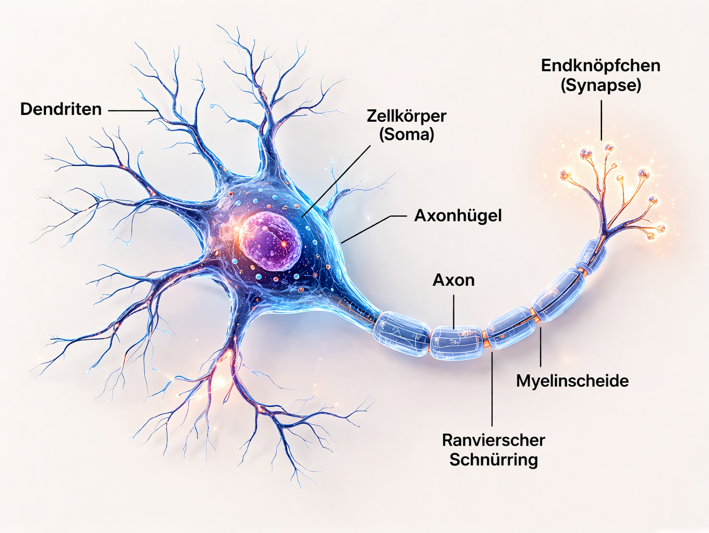

<ul style="list-style-type:circle;">
  <li>REFR - Prof. Franz Reichel</li>
  <li>DSAI - Data Science and Artificial Intelligence - 4XHIF</li>
</ul>

---

# Das biologische Neuron – Aufbau und Funktion

## 1. Was ist ein Neuron?

Ein **Neuron** (Nervenzelle) ist eine spezialisierte Zelle des Nervensystems.  
Seine Aufgabe ist es, **Informationen aufzunehmen, zu verarbeiten und weiterzuleiten**.

Neuronale Informationen werden dabei:
- **elektrisch** innerhalb der Zelle
- **chemisch** zwischen Zellen

übertragen.

---

## 2. Wie viele Neuronen hat ein Mensch?

Ein erwachsener Mensch besitzt ungefähr:

- **≈ 86 Milliarden Neuronen**
- davon ca. **16 Milliarden im Großhirn**
- der Rest verteilt sich auf:
  - Kleinhirn
  - Rückenmark
  - peripheres Nervensystem

📌 Zusätzlich existieren noch etwa **gleich viele Gliazellen**, die Neuronen versorgen und schützen.

---

## 3. Wie lange lebt ein Neuron?

- Die **meisten Neuronen leben ein Leben lang**
- Sie werden **kaum oder gar nicht ersetzt**

Ausnahmen:
- bestimmte Bereiche im Gehirn (z. B. Hippocampus)
- dort entstehen wenige neue Neuronen (Neurogenese)

📌 Merksatz:
> Neuronen sind extrem langlebig, aber sehr empfindlich.

---

## 4. Aufbau eines Neurons (alle Bestandteile)

### 4.1 Dendriten
- kurze, stark verzweigte Fortsätze
- nehmen **Signale von anderen Neuronen** auf
- je mehr Dendriten → desto mehr Eingänge

➡️ Vergleich: **Antennen**

---

### 4.2 Zellkörper (Soma)
- enthält Zellkern und Organellen
- verarbeitet die eingehenden Signale
- entscheidet, ob ein Signal weitergegeben wird

📌 Hier werden alle Eingangssignale „zusammengezählt“.

---

### 4.3 Axonhügel
- Übergang vom Zellkörper zum Axon
- **Entscheidungsstelle** des Neurons

➡️ Wenn die elektrische Spannung einen Schwellenwert überschreitet:
- entsteht ein **Aktionspotenzial**

---

### 4.4 Axon
- langer, dünner Fortsatz
- leitet das elektrische Signal weiter
- kann:
  - wenige Millimeter
  - bis über **1 Meter** lang sein (z. B. Die längsten Fortsätze verlaufen beispielsweise vom unteren Rückenmark bis in die Zehenspitzen)

➡️ Vergleich: **Datenkabel**

---

### 4.5 Myelinscheide (optional)
- fetthaltige Isolierschicht um das Axon
- beschleunigt die Signalweiterleitung stark
- gebildet durch Gliazellen

📌 Ohne Myelin:
- langsame Signalübertragung
- z. B. bei Multipler Sklerose gestört

---

### 4.6 Endknöpfchen (Synapse)
- Kontaktstelle zwischen zwei Neuronen
- kein direkter Kontakt!
- Signalübertragung erfolgt **chemisch**

Ablauf:
1. elektrisches Signal kommt an
2. Neurotransmitter werden ausgeschüttet
3. nächstes Neuron wird aktiviert oder gehemmt

➡️ Vergleich: **Funkübertragung**

---

## 5. Wie schnell arbeitet ein Neuron?

- Aktionspotenzial: ca. **1–2 Millisekunden**
- Leitungsgeschwindigkeit:
  - ohne Myelin: ~1 m/s
  - mit Myelin: bis zu **120 m/s**

📌 Trotz dieser Geschwindigkeit ist ein Computer **viel schneller**, aber:
> Das Gehirn arbeitet massiv parallel.

---

## 6. Was macht ein Neuron NICHT?

Ein Neuron:
- ❌ denkt nicht
- ❌ versteht keine Bedeutung
- ❌ speichert keine Erinnerungen allein

✔ Intelligenz entsteht durch:
- **Vernetzung vieler Neuronen**
- **Veränderung der Synapsen** (Lernen)

---

## 7. Verbindung zur Informatik / KI

Biologisches Neuron → künstliches Neuron:

| Biologie | KI |
|--------|---|
| Dendriten | Eingaben |
| Synapsen | Gewichte |
| Soma | Summierung |
| Axonhügel | Aktivierungsfunktion |
| Axon | Ausgabe |

📌 Künstliche neuronale Netze sind **stark vereinfacht**, aber inspiriert von dieser Struktur.

---

## 8. Merksätze

- Ein Neuron ist eine **Informationszelle**
- Neuronen können **ein Leben lang halten**
- Lernen passiert an den **Synapsen**
- Intelligenz entsteht durch **Vernetzung**, nicht durch einzelne Zellen
