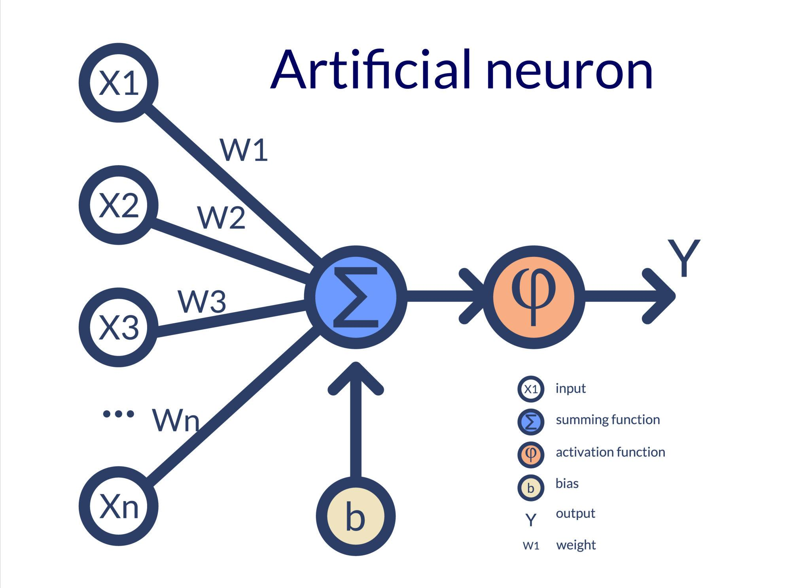
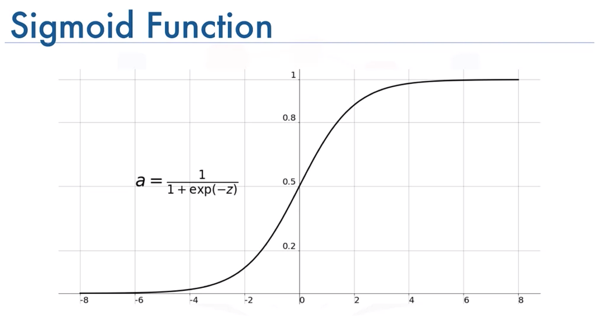
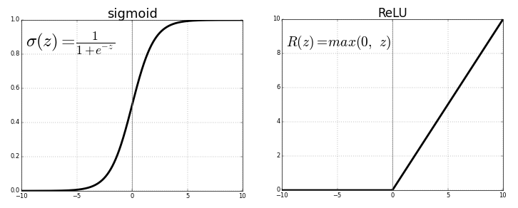

<ul style="list-style-type:circle;">
  <li>REFR - Prof. Franz Reichel</li>
  <li>DSAI - Data Science and Artificial Intelligence - 4XHIF</li>
</ul>

---

# Das Perzeptron – ein künstliches Neuron

## 1. Überblick

Das **Perzeptron** ist ein stark vereinfachtes, mathematisches Modell eines biologischen Neurons.  
Es wurde entwickelt, um die **Grundidee neuronaler Verarbeitung** auf den Computer zu übertragen.

👉 Wichtig:
> Das Perzeptron ist **kein echtes Neuron**, sondern eine **Rechenvorschrift**.

---

## 2. Detaillierte Beschreibung des Perzeptron

Im Bild sieht man ein einzelnes künstliches Neuron mit klar abgegrenzten Funktionsbereichen.

---

### 2.1 Eingaben \(x1, x2, x3, ⋯) (linke Seite)

- Jede Linie links stellt eine **Eingabe** dar.
- Eine Eingabe ist immer eine **Zahl**.
- Beispiele:
  - Helligkeit eines Pixels
  - Länge einer E-Mail
  - Wort kommt vor: 0 oder 1

**Biologisches Vorbild:**  
Dendriten – sie empfangen Signale von anderen Nervenzellen.

📌 Merksatz:
> Eingaben liefern die Rohinformationen.

---

### 2.2 Gewichte \(w1, w2, w3, ⋯)

- Jede Eingabe besitzt ein eigenes **Gewicht**.
- Das Gewicht bestimmt, **wie stark** diese Eingabe die Entscheidung beeinflusst.

Bedeutung:
- großes positives Gewicht → wichtiger Einfluss
- Gewicht nahe 0 → fast egal
- negatives Gewicht → hemmender Einfluss

**Biologisches Vorbild:**  
Synapsenstärke – starke oder schwache Verbindung zwischen Neuronen.

📌 Lernen bedeutet:
> Gewichte werden verändert.

---

### 2.3 Summierung

Alle gewichteten Eingaben laufen in der Mitte zusammen.

Mathematisch:

$
z = w_0 + w_1 \cdot x_1 + w_2 \cdot x_2 + w_3 \cdot x_3 + \dots
$

$
z = w_0 + \sum_{i=1}^{n} w_i \cdot x_i
$

$
z = w_0 + \mathbf{w}^\top \mathbf{x}
$

- Hier findet **keine Entscheidung**, sondern nur **Rechnen** statt.
- Alle Einflüsse werden addiert.

**Biologisches Vorbild:**  
Zellkörper (Soma), in dem Signale zusammengeführt werden.

---

### 2.4 Bias \(w0\)

- Der Bias ist ein zusätzlicher, konstanter Wert.
- Er verschiebt die Entscheidungsschwelle.

Ohne Bias:
- müsste die Trennlinie immer durch den Ursprung gehen
- das Modell wäre stark eingeschränkt

**Biologische Analogie:**  
Grundaktivität eines Neurons (sehr grobe Annäherung).

📌 Merksatz:
> Der Bias erlaubt flexible Entscheidungen.

---

### 2.5 Threshold (Schwellenwert - θ)

- Der Threshold ist ein **Grenzwert**, den die gewichtete Summe überschreiten muss, damit das Neuron „feuert".
- Er steht auf der **rechten Seite** der Entscheidungsbedingung:

$
\hat{y} = 1 \quad \text{wenn} \quad \sum_{i=1}^{n} w_i \cdot x_i \geq \theta
$

**Threshold vs. Bias – zwei Sichtweisen auf dasselbe:**

Das Threshold-Modell und das Bias-Modell sind **mathematisch äquivalent**.  
Man kann zwischen ihnen einfach umrechnen:

| Modell | Formel | Entscheidungsbedingung |
|--------|--------|----------------------|
| **Threshold** | $z = \sum w_i x_i$ | $z \geq \theta$ |
| **Bias** | $z = w_0 + \sum w_i x_i$ | $z \geq 0$ |

Der Zusammenhang: $b = w_0 = -\theta$

📌 Merksatz:
> Threshold und Bias beschreiben **dasselbe Verhalten** – nur aus verschiedenen Perspektiven.  
> In der Praxis wird fast immer der **Bias** verwendet, weil er wie ein normales Gewicht trainiert werden kann.

**Beispiel:**  
Threshold $\theta = 5$ entspricht einem Bias $w_0 = -5$.  
Beide führen zur identischen Entscheidungsgrenze.

**Biologisches Vorbild:**  
Der Axonhügel – ein Neuron feuert nur, wenn das Signal eine bestimmte Reizschwelle überschreitet.

---

## Aktivierungsfunktion (rechte Seite)

Nach der Summierung entscheidet die **Aktivierungsfunktion**, wie das Neuron reagiert.

Sie bildet den berechneten Wert $({z})$ auf die Ausgabe $(\hat{y})$ ab.

---

### Beispiel 1: Schwellwertfunktion (klassisches Perzeptron)

$
\hat y =
\begin{cases}
+1 & \text{wenn } z \ge 0 \\
-1 & \text{wenn } z < 0
\end{cases}
$

- sehr einfache Entscheidung
- nur **Ja / Nein**
- nicht stetig (sprunghaft)

📌 Vorteil: leicht zu verstehen  
📌 Nachteil: nicht gut lernbar mit Gradienten

---

### Beispiel 2: Sigmoid-Funktion (weiche Aktivierung)

Die **Sigmoid-Funktion** ist definiert als:

$
\sigma(z) = \frac{1}{1 + e^{-z}}
$

Eigenschaften:
- Ausgabe liegt **immer zwischen 0 und 1**
- kleine Änderungen in $({z})$ → kleine Änderungen in der Ausgabe
- interpretierbar als **Wahrscheinlichkeit**

Beispiel:
- $(\sigma(z) = 0.9) → $ „sehr wahrscheinlich"
- $(\sigma(z) = 0.1) → $ „sehr unwahrscheinlich"

---

### Vergleich der beiden Aktivierungsfunktionen

| Schwellwert | Sigmoid |
|------------|---------|
| harte Entscheidung | weiche Entscheidung |
| Ausgabe: −1 / +1 | Ausgabe: 0 … 1 |
| nicht differenzierbar | differenzierbar |
| Perzeptron | neuronale Netze |
| kein Gradient | Gradient möglich |

---

### Biologische Analogie

- **Schwellwertfunktion**:  
  Neuron feuert oder feuert nicht

- **Sigmoid-Funktion**:  
  Neuron feuert **stärker oder schwächer**

📌 Die Sigmoid-Funktion ist **keine biologische Realität**,  
sondern eine **mathematische Vereinfachung**, die Lernen ermöglicht.

---

### Übergang zu modernen neuronalen Netzen

> Sobald wir eine **stetige Aktivierungsfunktion** verwenden  
> (wie Sigmoid oder ReLU - (Rectified Linear Unit)),  
> können wir **Gradient Descent** und **Backpropagation** einsetzen.

➡️ Damit beginnt das **echte Lernen** in neuronalen Netzen.

---

### 2.6 Ausgabe $(\hat{y})$

- Die Ausgabe ist ein einzelner Wert.
- Typische Bedeutungen:
  - Spam / Ham
  - Objekt erkannt / nicht erkannt
  - Ja / Nein

📌 Wichtig:
> Das Perzeptron gibt **keine Wahrscheinlichkeit**, sondern eine harte Entscheidung aus.

---

## 3. Zusammenfassung: Biologie vs. Perzeptron

| Biologisches Neuron | Perzeptron |
|-------------------|-----------|
| Dendriten | Eingaben \(x_i\) |
| Synapsen | Gewichte \(w_i\) |
| Zellkörper | Summierung |
| Axonhügel | Aktivierungsfunktion / **Threshold** |
| Aktionspotenzial | Ausgabe |
