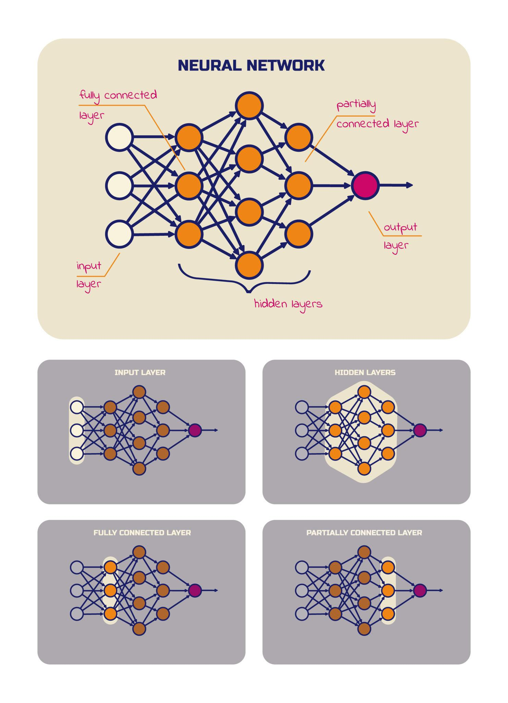
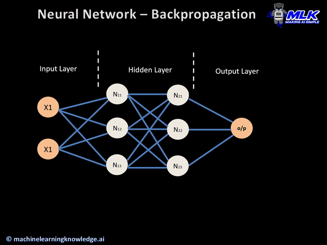

<ul style="list-style-type:circle;">
  <li>REFR - Prof. Franz Reichel</li>
  <li>DSAI - Data Science and Artificial Intelligence - 4XHIF</li>
</ul>

---

# Von einem Neuron zu neuronalen Netzen  
## Hidden Layers und Backpropagation

## 1. Rückblick: Was kann ein einzelnes Perzeptron?

Ein einzelnes Perzeptron kann:
- Eingaben gewichten
- eine lineare Entscheidung treffen
- zwei Klassen trennen

📌 Aber:
> Ein einzelnes Perzeptron kann **nur lineare Zusammenhänge** lernen.

Beispiel, das **nicht** geht:
- XOR-Problem
- komplexe Muster
- gekrümmte Entscheidungsgrenzen

---

## 2. Die Idee: Viele Neuronen zusammenschalten

Statt nur **ein** künstliches Neuron zu verwenden, verbinden wir **viele** davon.

Aufbau:
- **Eingabeschicht**: nimmt die Daten auf
- **Hidden Layer**: verarbeitet Zwischenmerkmale
- **Ausgabeschicht**: liefert das Ergebnis

➡️ Das nennt man ein **neuronales Netz**.

---

## 3. Hidden Layers – warum sind sie so wichtig?

Die **Hidden Layers** sind Schichten von Neuronen:
- sie liegen zwischen Eingabe und Ausgabe
- sie sind von außen **nicht direkt sichtbar**
- sie lernen **Zwischendarstellungen**

Beispiel (Bilderkennung):
 1. Layer: Kanten
 2. Layer: Formen
 3. Layer: Objekte

📌 Merksatz:
> Hidden Layers machen aus linearen Bausteinen  
> **nichtlineare Modelle**.

---

## 4. Mathematische Sicht (vereinfacht)

Ein Neuron in einem Hidden Layer berechnet:

$
z = \sum_{i} w_i \cdot x_i + b
$

danach:

$
a = f(z)
$

- \(z\): gewichtete Summe  
- \(f\): Aktivierungsfunktion (z. B. ReLU)  
- \(a\): Ausgabe an die nächste Schicht

➡️ Jede Schicht transformiert die Daten weiter.

---

## 5. Zentrale Frage: Wie lernt ein ganzes Netz?

Ein Netz hat:
- viele Gewichte
- viele Bias-Werte
- viele Neuronen

👉 **Wie passen wir all diese Werte sinnvoll an?**

Die Antwort heißt **Backpropagation**.

---

## 6. Backpropagation – die Grundidee

Backpropagation bedeutet:
> **Der Fehler wird von hinten nach vorne weitergegeben.**

Ablauf:
1. Netz macht eine Vorhersage
2. Fehler wird berechnet
3. Fehler wird **rückwärts** durch das Netz verteilt
4. Gewichte werden angepasst

---

## 7. Warum „rückwärts“?

- Der Fehler entsteht **am Ausgang**
- Aber die Ursache liegt in **allen vorherigen Gewichten**
- Jedes Gewicht bekommt einen Anteil an der Schuld

📌 Mathematisch basiert das auf der **Kettenregel**.

---

## 8. Vereinfacht

Vergleich:
> Klassenarbeit wird korrigiert  
> → Fehler werden markiert  
> → Schüler verbessern genau die Stellen,  
> die zum Fehler geführt haben

➡️ Genau das macht Backpropagation.

---

## 9. Lernregel (vereinfacht, ohne Ableitung)

Für jedes Gewicht gilt:
$[
w \leftarrow w - \eta \cdot \text{Fehleranteil}
$]

- $(\eta)$: Lernrate
- Fehleranteil: wie stark dieses Gewicht verantwortlich war

📌 Kleine Schritte, viele Wiederholungen.

---

## 10. Warum funktionieren neuronale Netze so gut?

- viele einfache Bausteine
- starke Nichtlinearität durch Aktivierungsfunktionen
- Lernen aus Daten statt expliziter Regeln

➡️ **Komplexes Verhalten entsteht aus einfachen Regeln.**

