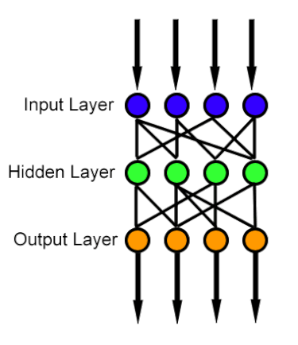
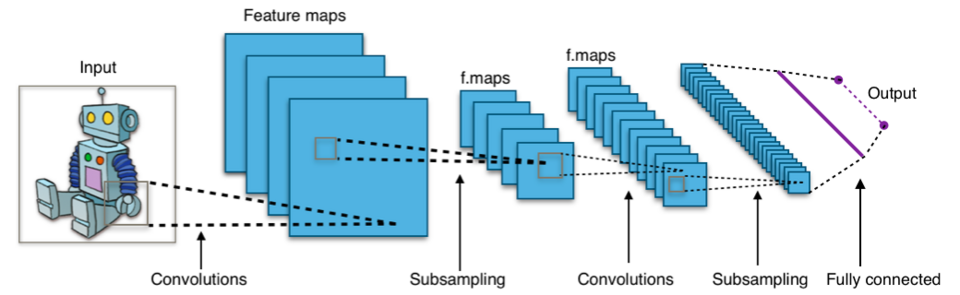
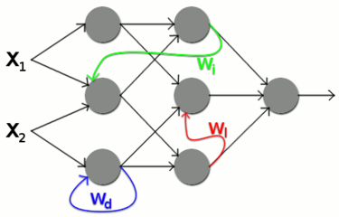
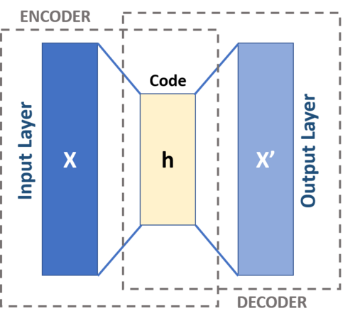
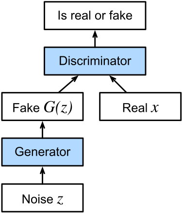
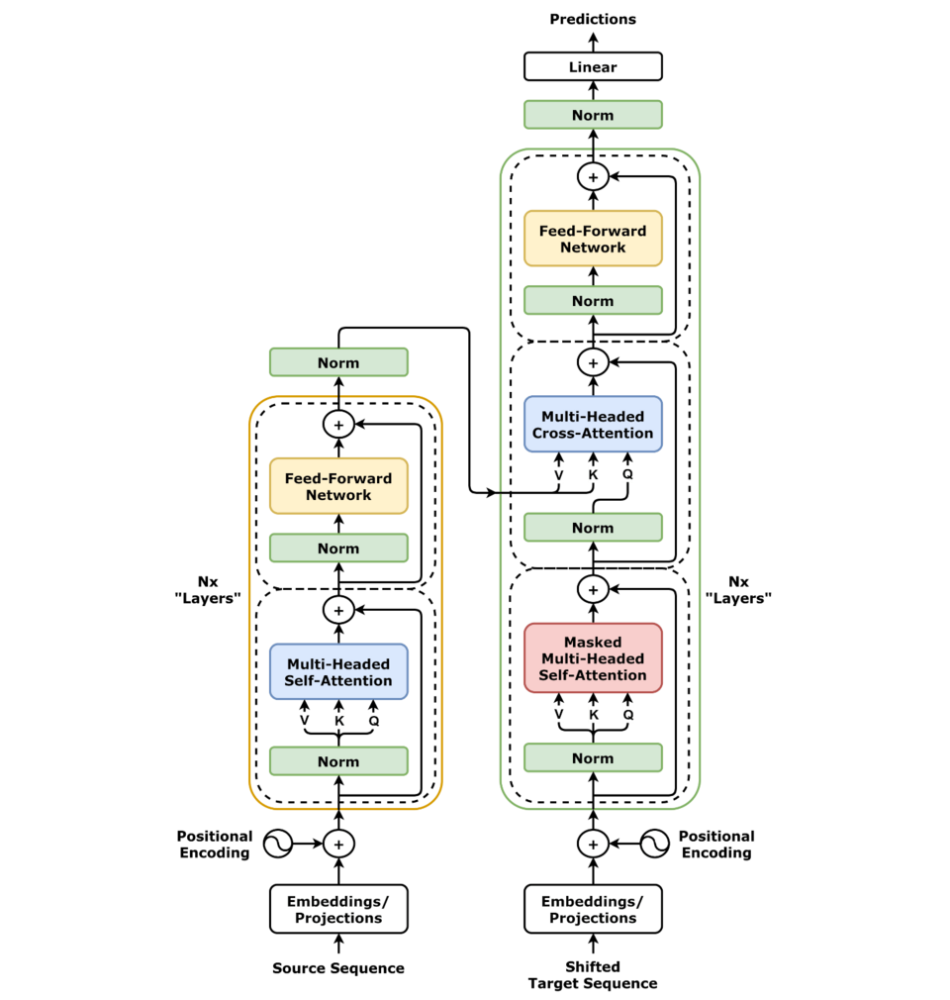
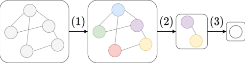
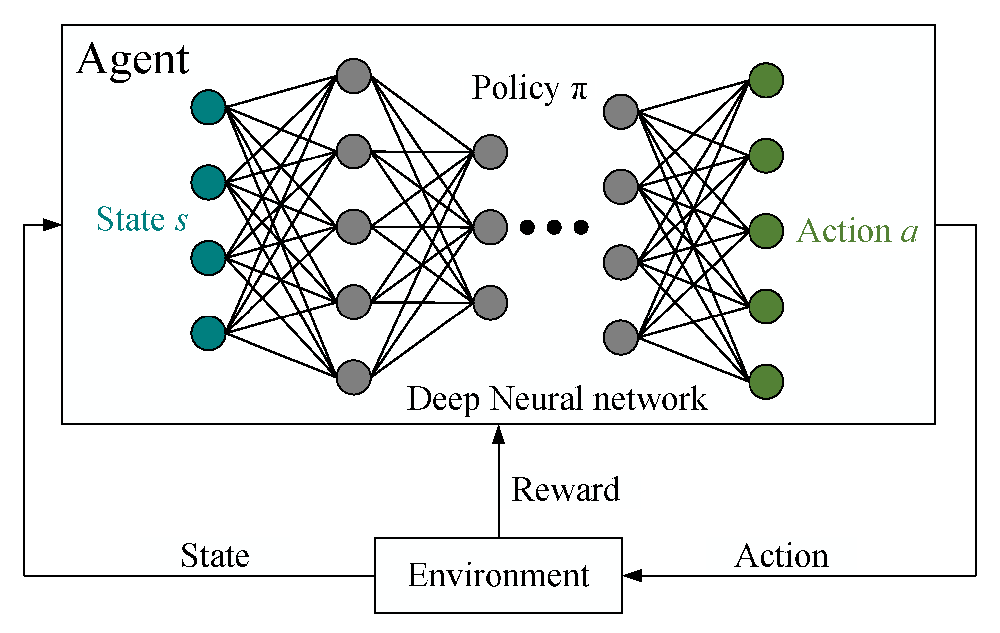

<ul style="list-style-type:circle;">
  <li>REFR - Prof. Franz Reichel</li>
  <li>DSAI - Data Science and Artificial Intelligence - 4XHIF</li>
</ul>

---

# Übersicht: Wichtige Arten neuronaler Netze

Dieses Dokument fasst die neun wichtigsten Typen neuronaler Netze zusammen – jeweils mit kurzer, klarer Beschreibung und typischen Einsatzgebieten.

---

## 1. Feedforward Neural Network (FNN / MLP) [wiki](https://en.wikipedia.org/wiki/Feedforward_neural_network)
Ein klassisches, vollständig verbundenes Netzwerk, in dem Informationen nur von vorne nach hinten fließen (keine Schleifen).  
**Einsatz:** Klassifikation, Regression, einfache Mustererkennung.  
**Merkmale:** Einfach, stabil, universeller Funktionsapproximator.

---

## 2. Convolutional Neural Network (CNN) [wiki](https://de.wikipedia.org/wiki/Convolutional_Neural_Network)
Ein Netzwerktyp, der Faltungen (Convolutions) verwendet, um lokale Muster in räumlichen Daten zu erkennen.  
**Einsatz:** Bilderkennung, Objekterkennung, medizinische Bildanalyse, Videoanalyse.  
**Merkmale:** Extrahiert automatisch Features wie Kanten, Texturen und Formen.

---

## 3. Recurrent Neural Network (RNN) [wiki](https://de.wikipedia.org/wiki/Rekurrentes_neuronales_Netz)
Netzwerke mit Schleifen, die Informationen über Zeit hinweg speichern können.  
**Einsatz:** Sequenzen, Text, Sprache, Zeitreihen.  
**Varianten:** LSTM, GRU, Bidirektionale RNNs.  
**Merkmale:** Modelliert zeitliche Abhängigkeiten, leidet jedoch oft unter Vanishing Gradient.

---

## 4. Autoencoder (AE) [wiki](https://de.wikipedia.org/wiki/Autoencoder)
Ein Encoder komprimiert Daten in eine latente Repräsentation, ein Decoder stellt sie wieder her.  
**Einsatz:** Anomalieerkennung, Feature Learning, Dimensionalitätsreduktion, Rekonstruktion.  
**Varianten:** Denoising Autoencoder, Sparse Autoencoder, Variational Autoencoder (VAE).

---

## 5. Generative Adversarial Network (GAN) [wiki](https://de.wikipedia.org/wiki/Generative_Adversarial_Networks)
Besteht aus zwei Netzen: Generator (erzeugt Daten) und Discriminator (erkennt Echt vs. Fake).  
**Einsatz:** Bildgenerierung, Deepfakes, Style Transfer, Data Augmentation.  
**Merkmale:** Training als Wettkampf, oft hochqualitative generative Ergebnisse.

---

## 6. Transformer [wiki](https://de.wikipedia.org/wiki/Transformer_(Maschinelles_Lernen))
Ein Architekturtyp, der auf Self-Attention basiert und ohne Rekursion oder Faltung auskommt.  
**Einsatz:** Textverarbeitung, Übersetzung, Codegenerierung, Bildverarbeitung (Vision Transformer).  
**Varianten:** BERT (Encoder), GPT (Decoder), T5 (Encoder-Decoder).  
**Merkmale:** Hervorragend skalierbar, Grundlage moderner KI.

---

## 7. Graph Neural Network (GNN) [wiki](https://en.wikipedia.org/wiki/Graph_neural_network)
Netzwerke, die auf Graphstrukturen (Knoten & Kanten) lernen.  
**Einsatz:** Moleküle, soziale Netzwerke, Empfehlungssysteme, Wissensgraphen.  
**Merkmale:** Nutzt Message-Passing zur Weitergabe von Informationen zwischen Knoten.

---

## 8. Reinforcement Learning Networks (Deep RL) [wiki](https://en.wikipedia.org/wiki/Deep_reinforcement_learning)
Neuronale Netze, die innerhalb eines Agenten-Umfeld-Systems trainiert werden.  
**Beispiele:** DQN, Policy Gradient, Actor–Critic.  
**Einsatz:** Robotik, Spiele (Go, Atari), autonomes Fahren, Optimierungsaufgaben.  
**Merkmale:** Lernen über Belohnungen statt über gelabelte Daten.

---
