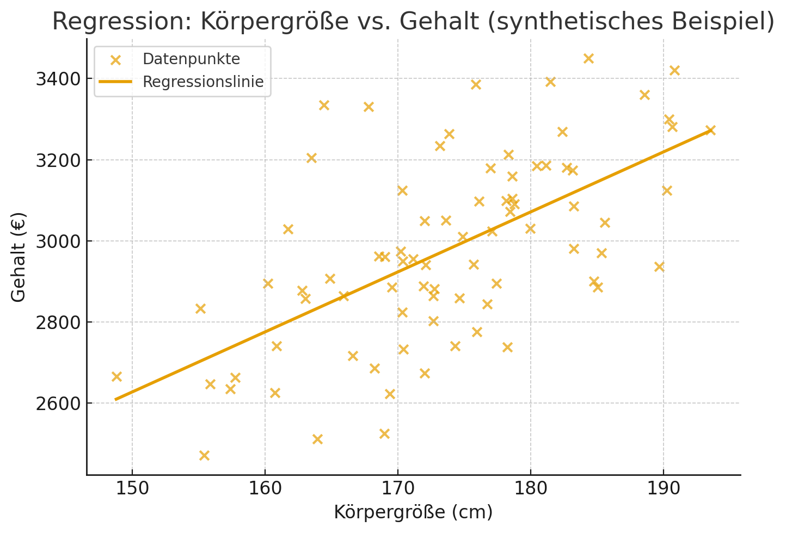

<ul style="list-style-type:circle;">
  <li>REFR - Prof. Franz Reichel</li>
  <li>DSAI - Data Science and Artificial Intelligence - 4XHIF</li>
</ul>

---
# Supervised Learning – Wichtigste Begriffe & Erklärungen

Supervised Learning bedeutet, dass ein Modell mit **Eingabedaten (x)** und **bekannten Zielwerten (y)** trainiert wird.  
Ziel ist es, eine Funktion zu lernen:

$
f(x) \approx y
$

Das Modell kann anschließend Vorhersagen für neue, unbekannte Daten treffen.

---

## 1. Prädiktor (Predictor)

Der Prädiktor ist die Funktion, die nach dem Training **Vorhersagen** erzeugt:

$
\hat{y} = f(x)
$

Beispiele:
- Klassifikation: „Hund“ oder „Katze“
- Regression: „Preis = 320.50 €“
- Spamfilter: „Spam / Nicht-Spam“

Der Prädiktor ist das Herzstück des Modells.

---

## 2. Lineare Regression

Ein einfaches, aber wichtiges Modell im Supervised Learning.

$
y = a \cdot x + b
$

- **a** = Steigung  
- **b** = Bias/Intercept  

Ziel:  
Eine Linie finden, die die Daten **optimal annähert**.

Beispiele:
- Quadratmeter → Immobilienpreis  
- Körpergröße → Gewicht  
- Arbeitsstunden → Produktivität  

---

## 3. Kriterium & Prädiktor (Regression)

In der Regression unterscheiden wir:

### 🔸 Prädiktor (unabhängige Variable, Feature, x)
Die Variable, mit der wir etwas **erklären oder vorhersagen** wollen.

Beispiele:
- Körpergröße  
- Alter  
- Werbebudget  
- Anzahl der Klicks  

### 🔸 Kriterium (abhängige Variable, Target, y)
Die Variable, die **vorhergesagt werden soll**.

Beispiele:
- Gehalt  
- Preis  
- Verkaufszahlen  
- Temperatur  

Formal wird geschätzt:

$
y = f(x)
$

wobei **x der Prädiktor** und **y das Kriterium** ist.

---

## 4. Richtung der Schlussfolgerung  
### („Regression kann nur in *eine Richtung* schließen“)

Eine Regression ist **gerichtet**:

$
x \rightarrow y
$

Das bedeutet:

- Wir können sagen:  
  **„Wenn x steigt, steigt (im Modell) das erwartete y.“**

- Aber wir können **NICHT** sagen:  
  **„Wenn y steigt, steigt x.“**

Warum?

1. **Das Modell wurde trainiert, um y aus x vorherzusagen — nicht umgekehrt.**  
2. Der Fehler wird **in Bezug auf y** minimiert (z. B. MSE), nicht in Bezug auf x.  
3. Statistische Korrelation ≠ Kausalität.  
4. Ein Modell für die Umkehrung müsste separat trainiert werden.

Beispiel:

> Modell gelernt: Körpergröße → Gehalt  
>  
> Aber: Gehalt → Körpergröße **ergibt keinerlei sinnvolle Aussage**.

---

## 5. Loss Function (Fehlerfunktion)

Sie misst, wie gut oder schlecht die Vorhersagen sind.  
Beim Training wird die Loss-Funktion **minimiert**.

### Mean Squared Error (MSE)

$
MSE = \frac{1}{n} \sum (y - \hat{y})^2
$

Diese Funktion verwendet den **quadratischen Abstand**.

---

## 6. Quadratischer Abstand

Fehler zwischen tatsächlichem Wert und Vorhersage:

$
(y - \hat{y})^2
$

Warum quadratisch?

- Große Fehler werden stark bestraft  
- Mathematisch gut differenzierbar  
- Grundlage der linearen Regression  

> Quadratischer Abstand = „Wie falsch ist die Vorhersage?“ 
>
> Der quadratische Abstand hilft dem Modell, richtig zu lernen.
---

## 7. Reasoning (Schlussfolgern im Supervised Learning)

Reasoning bedeutet hier:

> Das Modell nutzt die gelernten Muster, um neue Daten zu interpretieren und vorherzusagen.

Es ist kein echtes logisches Denken, sondern:

- Mustererkennung  
- statistisches Schlussfolgern  
- Anwendung gelernter Beziehungen  

Beispiele:
- Pixelmuster → Katze  
- Symptome → Diagnose  
- Text → Stimmungsanalyse  

> Reasoning = „Warum macht das Modell diese Vorhersage?
> 
> Reasoning beschreibt, was das Modell aus dem Gelernten macht.

---

## 8. Hypothese (Model Hypothesis)

Das Modell nimmt eine bestimmte **Form** der Funktion an.

Beispiele:
- linear: \( y = ax + b \)
- polynomial: \( y = ax^2 + bx + c \)
- neuronale Netze: hochkomplexe nichtlineare Funktion

Die Hypothesenklasse bestimmt, **was das Modell lernen kann**.

---

## 9. Training & Evaluation

### Schritte:
1. Daten splitten (Train, Test, Validation)  
2. Modell trainieren  
3. Loss minimieren  
4. Modell bewerten  

### Wichtige Metriken:
- **Regression:** MSE, RMSE, MAE, R²  
- **Klassifikation:** Accuracy, Precision,Recall, F1  

---

## 10. Overfitting

Überanpassung bedeutet, dass das Modell:

- Trainingsdaten **auswendig lernt**  
- aber bei neuen Daten **schlechte Leistung** zeigt

Gegenmaßnahmen:
- Regularisierung  
- Einfacheres Modell  
- Early Stopping  
- Mehr Daten  

---

## 11. Generalisierung

Ein gutes Modell kann auf **neuen, unbekannten Daten** zuverlässig Vorhersagen treffen.

Generalisation ist das Hauptziel von Supervised Learning.

---

## Zusammenfassung – zentrale Begriffe

| Begriff | Erklärung |
|--------|-----------|
| **Prädiktor** | Eingangsvariable (x), Feature |
| **Kriterium** | Zielvariable (y), Target |
| **Lineare Regression** | Modelliert linearen Zusammenhang |
| **Loss Function** | misst den Fehler zwischen y und ŷ |
| **Quadratischer Abstand** | (y − ŷ)², Basis von MSE |
| **Reasoning** | statistisches Schlussfolgern |
| **Hypothese** | angenommene Modellform |
| **Generalisation** | Leistung auf neuen Daten |
| **Overfitting** | Modell lernt Rauschen statt Muster |
| **Gerichtete Regression** | nur x → y, nicht umgekehrt |
